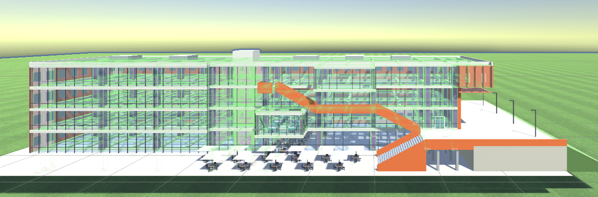
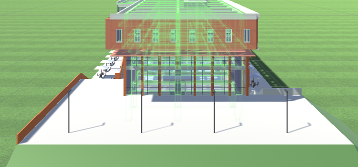
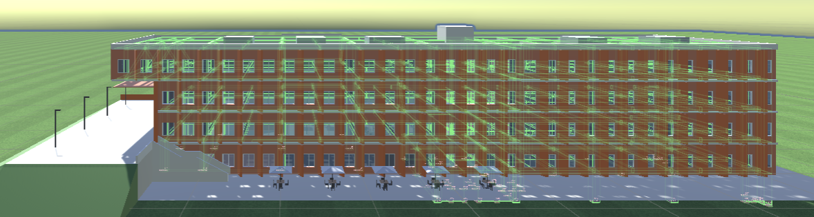
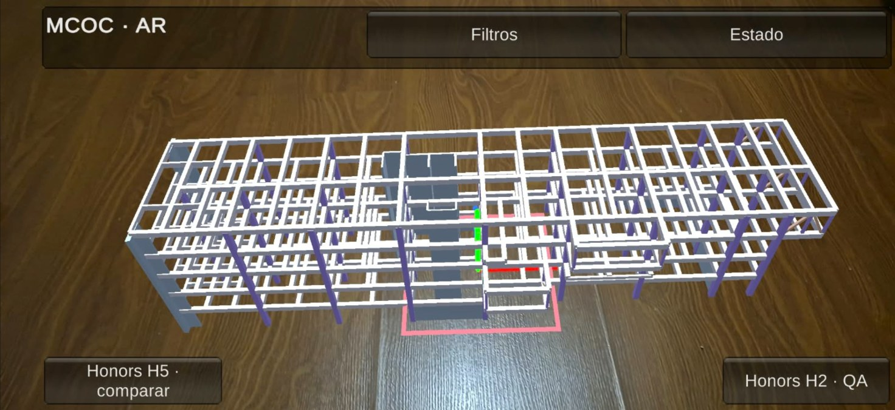

# MCOC P1 · Grupo 8 — Edificio G35: OpenSees + Unity + AR

Este proyecto modela dos edificios de hormigón armado G35, con perfiles metálicos A36, separados por una junta de dilatación. El edificio 1 sale de los planos 2017_67 y el edificio 2 de los planos 2024_22. El análisis se hace con OpenSeesPy desde Python. Unity funciona como pre y postprocesador, y sobre el mismo proyecto corre una app de realidad aumentada para Android.

**Flujo:** planos DXF → modelo JSON (`Proyecto1/data`) → OpenSees (`Proyecto1/scripts`) → resultados JSON → viewer Unity y AR (`Proyecto1/edificio_G8`).

**Informe final:** [`reports/final.md`](reports/final.md).

**Origen:** la base del sistema (modelo, análisis, viewer y AR) proviene del repositorio [P1_G4_Final](https://github.com/mauricio-lenz/P1_G4_Final) del grupo 4. Los cambios del grupo 8 se detallan en las secciones 20 y 21 del informe.

## Requisitos

| Componente | Versión |
|---|---|
| Sistema operativo | Windows 10 u 11 de 64 bits |
| Python | **3.12** (3.12.10), en el PATH como `python` |
| OpenSeesPy | **3.8.0.0** |
| Otras dependencias de Python | numpy 2.5.2, matplotlib 3.11.1, openpyxl 3.1.5, pillow 12.3.0, ezdxf 1.4.4 y pytest 9.1.1. Todas tienen la versión fija en `requirements.txt` |
| Unity | **6000.6.0f1**, con los módulos Android Build Support y Windows Build Support (IL2CPP) |
| Paquetes de Unity | AR Foundation 6.6.2, Google ARCore XR Plugin 6.6.2 y XR Management 4.7.0. Unity los instala solo al abrir el proyecto |
| Teléfono (AR) | Android compatible con ARCore, con la depuración USB activada |

Para instalar las dependencias de Python, desde la raíz del repositorio:

```bat
python -m pip install -r requirements.txt
```

`Ejecutar.bat` abre un menú con los pasos 1 a 4 de este README, e instala las dependencias si faltan.

## 1. Ejecutar el análisis

Este comando corre G, Q, EX, EY y C1 a C3 en OpenSees, calcula la capacidad ACI 318-19 y escribe el JSON que lee Unity:

```bat
python -X utf8 Proyecto1\scripts\exportar_resultados_unity.py
```

- **Entradas:** se leen de `Proyecto1/data/`. Ahí están `parametros_analisis.json` (q_G, Q, Q de cubierta, sismo NCh433 y rigidez fisurada), `combinaciones.json` y `armaduras.json`.
- **Rigidez vigente:** 0,35 Ig en vigas, 0,70 Ig en columnas y 1,0 Ig en muros. Los muros son `ElasticTimoshenkoBeam`, con deformación por corte. La rigidez está calibrada con el modelo ETABS de referencia (sección 8 del informe).
- **Opciones de consola:** tienen prioridad sobre esos archivos. Por ejemplo `--q-kg-m2 300`, `--suelo D` o `--sc 0.2` (C fijo). Con `--help` se ven todas.
- **Salida:** `Proyecto1/edificio_G8/Assets/Resources/estructura_p1l4_unity.json`. El bloque `corrida` guarda el comando, las versiones y el hash de cada entrada.
- **Entradas inválidas:** si una entrada no es válida, el script termina con código 2 y escribe `ERROR de validacion: …`.

## 2. Generar los demás resultados

| Comando (desde la raíz) | Resultado |
|---|---|
| `python -X utf8 Proyecto1\scripts\qa_semana06.py` | QA en unos 10 s: equilibrio, corte basal, NCh433, superposición, M-φ, P-M e IDs. Evidencia en `Proyecto1/resultados/qa_semana06.json` |
| `python -X utf8 Proyecto1\scripts\exportar_excel_esfuerzos.py` | `Proyecto1/resultados/esfuerzos_por_elemento.xlsx`, con esfuerzos por elemento y combinación |
| `python -X utf8 Proyecto1\scripts\sensibilidad_rigidez.py` | `Proyecto1/resultados/sensibilidad_rigidez.json`, que compara sección bruta y rigidez fisurada |
| `python -X utf8 Proyecto1\scripts\figuras_informe.py` | figuras del informe en `reports/img/`. No necesita OpenSees |
| `python -X utf8 Proyecto1\scripts\actualizar_armadura.py` | recalcula capacidad, DCR y curvas P-M en el JSON de Unity después de editar `data/armaduras.json`, sin OpenSees (la armadura no cambia las fuerzas) |
| `python -X utf8 Proyecto1\scripts\generar_arquitectura.py` | arquitectura **solo visual** del viewer (fachadas, escaleras, plaza de la entrada en el piso 2, sala y cafetería) en `Assets/Resources/arquitectura_visual.json`. Revisa que nada choque con la estructura. `--preview carpeta` guarda vistas previas. No toca el modelo ni los resultados |
| `python -X utf8 Proyecto1\scripts\ajustar_modelo_planos.py` | reconstruye el modelo desde el respaldo con los 16 ajustes a planos y vuelve a exportar. `--dry-run` solo muestra el resumen |

Los ejes de grilla se leen de los DXF con `generar_ejes_grilla.py`. Los planos no están en el repositorio: el script los busca en la carpeta `../Planos_1_dxf`.

## 3. Ejecutar los tests

```bat
python -m pytest                  :: 51 casos (51 passed con OpenSees real el 7 de octubre de 2026)
python -m pytest -m "not lento"   :: sin las corridas completas del exportador, unos 10 s
```

La suite está en `tests/`. Verifica el modelo, las cargas, la capacidad, el JSON de Unity, el reanálisis desde Unity y el cambio de armadura. El detalle está en la sección 18 del informe.

## 4. Abrir el viewer

1. Abrir el proyecto con `Abrir_Unity.bat`, o desde Unity Hub abrir `Proyecto1/edificio_G8` con Unity 6000.6.0f1. El .bat usa Direct3D 11 (`-force-d3d11`), porque D3D12 cierra el editor en algunos equipos.
2. Cargar la escena `Assets/Scenes/StructureViewerScene` y presionar Play.
3. Para recalcular (*Reanalizar*, *Quitar elemento*, cambios de sección y armadura), ejecutar una vez `instalar_dependencias.bat`. Instala openseespy en Python 3.12 (sección 4.2).

**Cómo se ve.** Capturas del viewer en Unity con las tres capas de arquitectura activas (VISTA → *Arquitectura*). La estructura del modelo se ve en verde a través del vidrio. La arquitectura es solo visual y no cambia ningún valor.



*Fachada sur. La escalera naranja baja desde el piso 4, pasa sobre la sala de Métodos Computacionales y llega a la plataforma del piso 2. Desde ahí, la escalinata baja a la terraza de la cafetería, que tiene mesas con quitasol. La cafetería se ve bajo la sala.*



*Extremo este. La plaza de la entrada principal está a la altura del piso 2, con faroles y antepecho naranja, y por ese lado la planta baja queda bajo la plaza.*



*Fachada norte. La escalera de dos tramos con descanso baja desde la plaza hasta la terraza norte, que tiene mesas y quitasoles.*

**Pestañas del viewer.** Cada pestaña muestra un solo panel a la vez, así que nada queda encima de otra cosa.

- **VISTA:** capas, filtro por piso, áreas tributarias y *Restablecer posición y tamaño de los paneles*.
  - *Arquitectura (solo visual):* interruptores *Fachada*, *Escaleras y entorno* y *Mobiliario*.
  - Muestran las fachadas (vidrio al sur, aletas naranjas al norte) y el terreno en dos niveles: la plaza de la entrada principal al este, a la altura del piso 2, y la cafetería con sus terrazas un piso más abajo.
  - También la escalera naranja hasta la plataforma del piso 2, la escalinata y la escalera norte de dos tramos con descanso, la sala de Métodos Computacionales (6 mesas cuadradas altas con taburetes) y la cafetería bajo la sala.
  - No están en el modelo de OpenSees, no se seleccionan y no cambian ningún valor.
  - La fachada y el entorno se ocultan solos al mostrar un diagrama, la utilización o un solo piso. En ese caso el pasto baja bajo los apoyos y se ve el subterráneo.
- **RESULTADOS:** diagramas (axial, corte, momento), deformada con animación, superposición en vivo (λG, λQ, λEX, λEY) y colores por utilización.
- **CARGAS:** tres sub-paneles, todos instantáneos.
  - *Carga móvil:* sobre un recorrido de vigas.
  - *Carga en elemento:* puntual o distribuida, con flechas en 3D. Se ve sola o sumada a G, C1, C2 o C3, con los esfuerzos del elemento.
  - *Persona (SQ4):* una persona camina por la losa con W A S D. Se ve el paño que pisa, las vigas que reciben su peso y la carga de cada una.
- **MODIFICAR:** cinco sub-paneles, que requieren reanálisis.
  - *Sección:* cambia la sección de una viga o columna.
  - *Armadura:* cambia la armadura.
  - *Apoyo:* empotrado, articulado, deslizante o sin apoyo.
  - *Área trib.:* cambia el área tributaria de una viga.
  - *Quitar:* activa o desactiva elementos.

  Al terminar el reanálisis aparece un resumen de resultados, con botones para ver la deformada animada, los momentos y la utilización.
- **ANÁLISIS:** parámetros de carga, sismo NCh433, material (f'c), rigidez, combinaciones y *Reanalizar el modelo completo*. Aquí también están la guía de qué requiere reanálisis y el diagnóstico de Python.
- **Capacidad:** al seleccionar una columna o un muro aparece su curva P-M con el punto de demanda. Al seleccionar una viga aparecen M(x) y V(x) contra su capacidad, con CUMPLE o NO CUMPLE.
- **Propiedades (panel derecho):** al seleccionar un elemento, el panel responde las seis preguntas del curso:
  1. ¿Dónde está? (tag, piso, nodos y ejes locales)
  2. ¿Cómo está apoyado? (restricciones de sus nudos)
  3. ¿Qué lo carga? (área y carga tributaria)
  4. ¿Cómo se deforma? (desplazamientos de sus extremos y, en columnas, la deriva del entrepiso)
  5. ¿Qué fuerzas tiene? (esfuerzos en el punto tocado y en los extremos)
  6. ¿Cuánta capacidad tiene? (sección, armadura, curva P-M y factor de uso del caso activo)

  En columnas y muros, el panel P-M muestra la curva con el punto de demanda del caso o combinación activa.

**Cambiar una sección.**

1. Selecciona una viga o columna de hormigón con un clic.
2. En MODIFICAR → *Sección*, elige otra sección del modelo, usa *Más pequeña* / *Más grande*, o ajusta b y h con los botones de ±5 cm.
3. El panel muestra cómo cambian el área, la inercia y el peso propio.
4. Toca *Agregar cambio*. Con la casilla *Aplicar a todos los elementos con la misma sección*, el cambio se aplica a todas las vigas o columnas de esa sección.
5. Toca *Reanalizar ahora*. OpenSees recalcula rigidez, peso propio, esfuerzos y capacidad; los archivos del modelo no se modifican.

**Paneles.** El panel izquierdo, el de propiedades, el de P-M y la tabla de valores del diagrama se mueven arrastrando su franja superior. Los paneles se agrandan o achican desde la esquina inferior derecha. Doble clic en la franja los devuelve a su lugar, y la posición queda guardada.

**Controles**

| Acción | Mouse o teclado | Celular |
|---|---|---|
| Seleccionar | clic izquierdo (sin arrastrar) | tocar |
| Orbitar | arrastrar con el botón izquierdo o el derecho | arrastrar con un dedo |
| Desplazar | arrastrar con el botón central, Shift + arrastrar, o flechas | arrastrar con dos dedos |
| Zoom | rueda | pellizcar |

La órbita es libre, sin vistas fijas: sigue al mouse en grados por píxel, sin saltos según los FPS. Un arrastre solo empieza fuera de los paneles. La deformada se anima con la casilla *Animar deformada* de la barra superior. En el teclado, las teclas 1 a 4 muestran Axial, Corte, Momento y Deformada, y 0 oculta el diagrama.

### 4.1 Si aparece la interfaz antigua

La interfaz antigua es una barra superior simple con *Resultado: None · Axial…* y una barra de diagramas con *Etiquetas* y *Escala*. Si aparece, la interfaz nueva con pestañas no se pudo crear.

- *Agregado automático:* la interfaz nueva se agrega aunque la escena haya fallado antes de hacerlo.
- *Respaldo de estilos:* si faltan los archivos de estilo, se usa el tema por defecto de Unity.
- *Aviso con el motivo:* si algo falla, aparece una franja roja abajo con el motivo exacto, también en la Consola con el prefijo `[ViewerUI]`. Copien ese mensaje para revisarlo.
- *Interfaz antigua ordenada:* aun así, la interfaz antigua ya no tiene textos encimados, y desde ahí se puede seguir recalculando.

### 4.2 Python y OpenSees para recalcular

El error "Falta openseespy" al recalcular significa que el Python que llama Unity no tiene OpenSeesPy instalado. OpenSeesPy 3.8 necesita Python 3.12.

- **Instalación:** `instalar_dependencias.bat` instala las dependencias en Python 3.12 y comprueba que openseespy se pueda importar.
- **Cómo elige Python Unity:** prueba, en orden:
  1. la ruta de la variable de entorno `MCOC_PYTHON`;
  2. `py -3.12`;
  3. `python`;
  4. `py`.

  Usa el primero que tenga openseespy.
- **Revisar Python:** el botón de la pestaña ANÁLISIS muestra qué Python y qué motor de cálculo se usarán.
- **Sin OpenSees:** la casilla *Si falta OpenSees, calcular con el solver de verificación* permite recalcular igual. Usa `replica_opensees.py`, una réplica en numpy/scipy de las funciones de OpenSees que usa el proyecto, validada contra corridas reales (mismos resultados).
  - El JSON queda marcado con `"motor": "replica de verificacion (sin OpenSees)"`.
  - La corrida oficial de la entrega debe hacerse con OpenSees.

**Apariencia.** La paleta "Arrebol" está en `Assets/Scripts/Paleta.cs`, y los estilos de los paneles en `Assets/Resources/UI/viewer.uss`. Para retocar un color basta con cambiarlo ahí.

## 5. Compilar el producto ejecutable

Desde los menús del editor de Unity:

| Menú | Salida (en `Proyecto1/edificio_G8/`) |
|---|---|
| `MCOC/Build Windows (viewer)` | `Builds/Windows/P1G8_Viewer.exe` |
| `MCOC/Build Android (APK)` | `Builds/Android/P1G8_Viewer.apk` |
| `MCOC/AR/Build Android AR (APK)` | `Builds/Android/P1G8_AR.apk` |

También se puede compilar por consola, con Unity cerrado:

```bat
Unity.exe -batchmode -quit -force-d3d11 -projectPath Proyecto1\edificio_G8 -executeMethod BuildWindows.Build
Unity.exe -batchmode -quit -force-d3d11 -projectPath Proyecto1\edificio_G8 -executeMethod BuildAndroid.Build
Unity.exe -batchmode -quit -force-d3d11 -projectPath Proyecto1\edificio_G8 -executeMethod BuildAndroid.BuildAR
```

**Instalar en el teléfono.** Con la depuración USB autorizada, correr `adb install -r P1G8_AR.apk`. Las apps se identifican como `cl.uandes.mcoc.p1g8` y `cl.uandes.mcoc.p1g8.ar`.

**Capturas automáticas.** El viewer de Windows puede generar las capturas de la demo base:

```bat
Proyecto1\edificio_G8\Builds\Windows\P1G8_Viewer.exe -autoshot "%CD%\reports\img\demo" -demo
```

Las carpetas `Builds/` no se suben al repositorio: los ejecutables van en la release (ver el paso 7). La excepción es la APK de realidad aumentada lista para instalar, que está en `APK/` (sección 6).

## 6. Realidad aumentada

**APK lista para instalar.** Está en `APK/P1G8_Honors_H5_H2_H3_fix03.apk`, con los Honors H2 (QA), H3 (diagramas My y Vz, apagado al abrir) y H5 (comparar armaduras).

- Versión 0.5.3 (build 109), package `cl.uandes.mcoc.p1g8.ar.honors`. Es otro package que la app base, así que se instalan las dos sin reemplazarse.
- Requiere Android 10 o superior (ARM64), un teléfono compatible con ARCore y permiso de cámara.
- Instalar con `adb install -r APK\P1G8_Honors_H5_H2_H3_fix03.apk`, o copiando el archivo al teléfono y abriéndolo.
- SHA-256: `c2bf7f5ca4b15699193b093526ab948cc2b8354e016b121f949cd68a5cad4d4c`.
- **Estado:** es la APK FIX03 original, probada y aprobada por el grupo en un teléfono Android (octubre de 2026). Esa prueba no se repitió al integrar el proyecto.
- La APK candidata fusionada `P1G8_Honors_FUSION_fix03_candidata_v2.apk` (compilada desde el proyecto integrado) **no es la APK oficial, no está en este repositorio y no se probó en un teléfono.** Está firmada con otra clave de depuración: para instalarla hay que desinstalar antes la oficial.

Al anclar el marcador aparece el edificio completo en maqueta 1:100. Arriba están los botones *Filtros* y *Estado*, y abajo *Honors H5 · comparar* y *Honors H2 · QA*.



*La APK en un teléfono: el edificio en maqueta 1:100 anclado sobre el marcador, con los botones de filtros, estado y Honors H5 y H2.*

**Uso del marcador.**

1. Imprimir `Proyecto1/ar/marcador_E1_243_imprimir.pdf` al 100 % y comprobar que el cuadrado mida 20 cm.
2. Pegarlo en la cara +X de la columna **E1_243** (eje F-3, sala del voladizo), con el centro a 1,20 m del piso.
3. Abrir la app y apuntar al marcador a 30–50 cm, hasta que se ancle.
4. Elegir un modo: 1:1 COLUMNA, MAQUETA 1:100 (marcador sobre la mesa) o SOBRE PLANO.

Si se cambia el marcador:

1. Correr `python -X utf8 Proyecto1\scripts\generar_marcador_ar.py`.
2. En Unity, usar el menú `MCOC/AR/Actualizar marcador (libreria de imagenes)`.
3. Volver a compilar el APK.

## 7. Entrega: subir a GitHub

```bat
git add .
git commit -m "Integrar versión final para entrega"
git push -u origin main
```

En Canvas se entrega:

- el enlace al repositorio;
- el hash del commit;
- el enlace directo a `reports/final.md`.

La APK de realidad aumentada lista para instalar está en `APK/P1G8_Honors_H5_H2_H3_fix03.apk`; las carpetas `Builds/` no se suben al repositorio.

## Estructura

```text
Proyecto1/
├─ data/          modelo, parámetros, combinaciones, armaduras y ejes de grilla
├─ scripts/       carga_viva_sismo.py (núcleo OpenSees), exportar_resultados_unity.py,
│                 ajustar_modelo_planos.py, capacidad_ha.py (ACI 318), validacion_entradas.py,
│                 qa_semana06.py, figuras_informe.py, generar_marcador_ar.py, quitar_elemento.py,
│                 carga_movil.py, carga_elemento.py, modificar_modelo.py,
│                 generar_arquitectura.py (capa solo visual del viewer), …
├─ edificio_G8/   proyecto Unity (viewer + AR); resultados en Assets/Resources/
│                 (arquitectura_visual.json: fachada y mobiliario, solo visual)
├─ ar/            marcador AR para imprimir
└─ resultados/    evidencia del QA, sensibilidad y Excel de esfuerzos
APK/              APK de realidad aumentada lista para instalar (Honors H2, H3 y H5)
tests/            suite pytest
reports/          informe final (final.md), sus figuras y las capturas de Unity (img/) y de la app AR (img/ar/)
```
