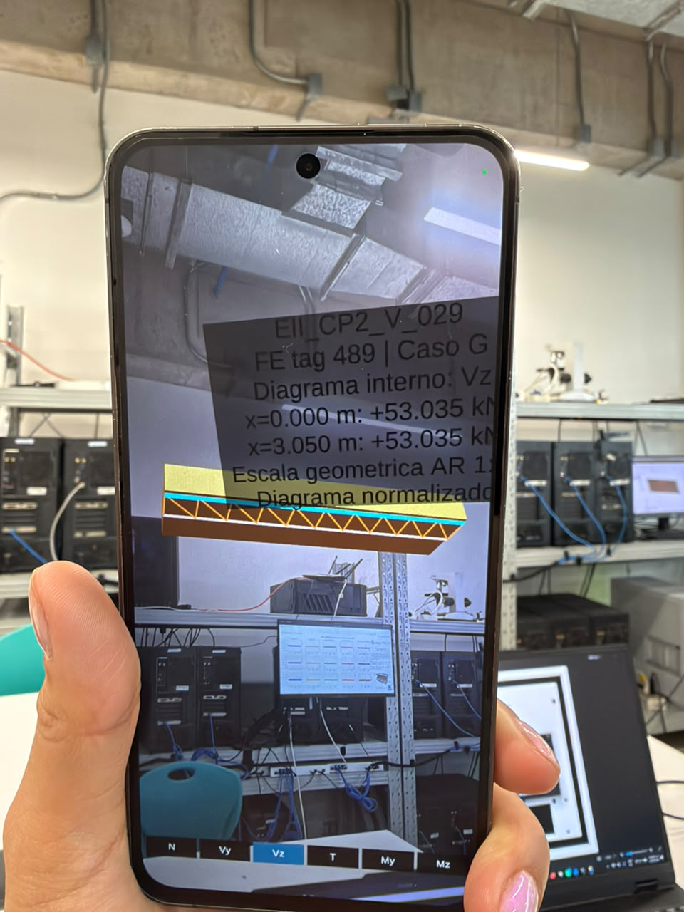
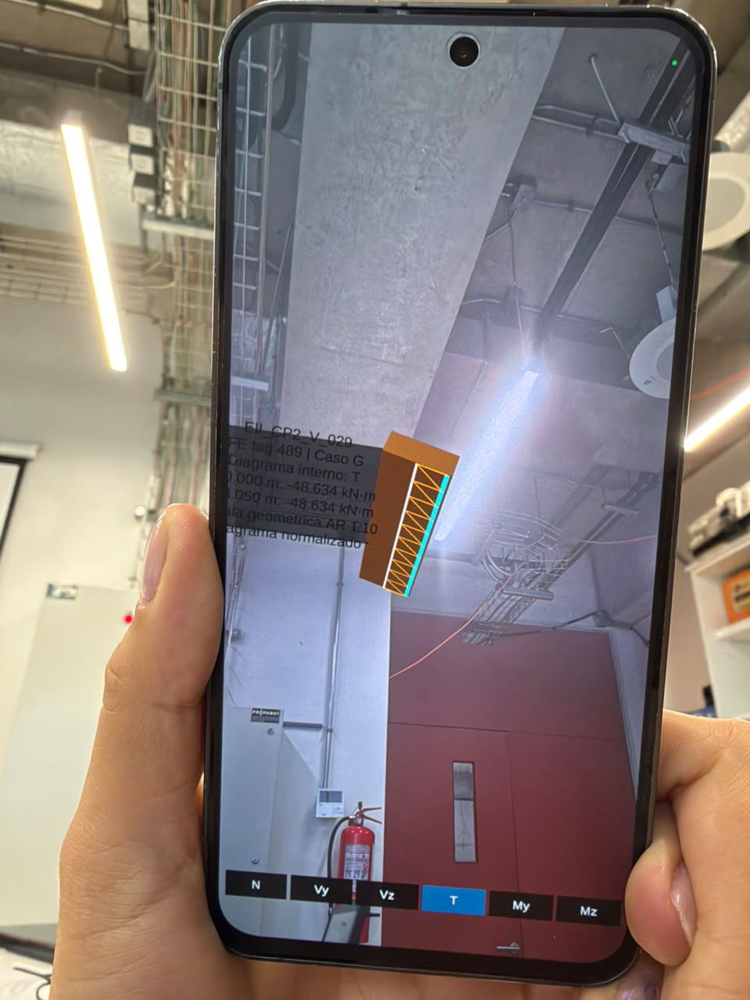
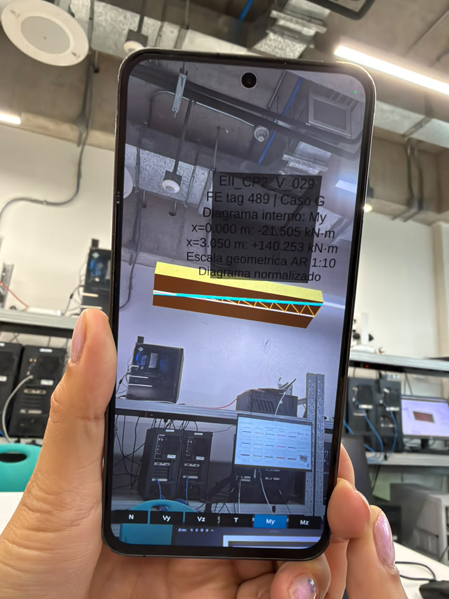

# Semana 6 — Demostración AR del elemento estructural FE (tag 489) con diagramas internos y versión final probada en teléfono

> **Rama:** `semana-06-ar`
> **Versión del editor:** Unity 6000.5.10f1 — render pipeline built-in
> **Release final:** [`semana-06-ar-v1`](https://github.com/Jo-18/P1-Grupo-8/releases/tag/semana-06-ar-v1) (compilación probada físicamente)
> **Compilación previa (histórica):** [`semana-06-ar-pre1`](https://github.com/Jo-18/P1-Grupo-8/releases/tag/semana-06-ar-pre1) — prerelease sin prueba física, ver §9
> **Fecha de la evidencia:** 30 de septiembre de 2026

## 1. Estado de la entrega

**Estado: VERSIÓN FINAL PROBADA FÍSICAMENTE EN TELÉFONO el 30 de septiembre de 2026.** Se publica en la release normal `semana-06-ar-v1`.

En esta semana se implementó la representación en Realidad Aumentada (AR) del elemento estructural `EII_CP2_V_029` (tag FE `489`) del Edificio II, junto con la lectura local del resultado de esfuerzo del caso `G` y de sus **diagramas internos** (51 estaciones reales) con selector táctil de magnitud `N | Vy | Vz | T | My | Mz`.

La prueba física en un teléfono Android **fue exitosa**: permiso de cámara concedido, marcador reconocido, pose AR obtenida, anchor creado, viga `EII_CP2_V_029` (tag `489`, sección `V.30/80`, escala 1:10) visible junto con los diagramas, ambos estables bajo el mismo anchor, y las seis magnitudes comprobadas desde el selector. La secuencia completa, los logs y las capturas están en [§15](#15-evidencia-de-la-prueba-física-en-teléfono).

## 2. Requisitos de Semana 6

| Requisito | Implementación en Unity | Estado |
|---|---|---|
| Iniciar sesión AR | Componente `ARSession` en la escena `ARMain` | Implementado y compilado |
| Detectar imagen de referencia | `ARTrackedImageManager` + librería de imágenes de referencia con `REF_EII_CP2_V_029` | Implementado y compilado |
| Obtener pose de la imagen | `ARTrackedImage.transform` (rotación y traslación del marcador detectado) | Implementado y compilado |
| Crear anchor persistente | `ARAnchorManager.TryAddAnchorAsync` sobre la pose detectada | Implementado y compilado |
| Transformación de coordenadas | Conversión OpenSees → Unity: `(x,y,z) = (u, cota, v)` y del espacio local al anchor (`T_anchor × local`) | Implementado y compilado |
| Mostrar elemento estructural | Viga `EII_CP2_V_029` como primitivo con las dimensiones de la sección `V.30/80` a escala `1:10` | Implementado y compilado |
| Usar el mismo tag FE | Tag `489` leído desde el JSON en `StreamingAssets` | Implementado y compilado |
| Mostrar el resultado | Caso `G` y sus seis diagramas internos de 51 estaciones, con selector `N \| Vy \| Vz \| T \| My \| Mz` (inicial `Vz`) | Implementado, compilado y **probado** |
| Verificación en dispositivo | Instalación, tracking del marcador, estabilidad del anchor y selector táctil en un teléfono Android | **Probado físicamente el 30/09/2026** (§15) |

## 3. Elemento mostrado

El elemento representado en AR es el tag FE 489 de la malla del Edificio II:

| Propiedad | Valor |
|---|---|
| Edificio | II |
| Tag FE (OpenSees) | `489` |
| Viewer ID | `EII_CP2_V_029` |
| Tipo | viga |
| Sección | `V.30/80` (ancho 0.30 m, peralte 0.80 m) |
| Nivel | `EII_CP2` |
| Punto inicial `p_i` | `(-3.35, 3.91, 4.265)` |
| Punto final `p_j` | `(-0.30, 3.91, 4.265)` |
| Longitud real | `3.05 m` |
| Escala de la escena AR | `1:10` |
| Longitud AR | `0.305 m` |
| Dimensiones de la viga AR | `0.03 × 0.08 m` (sección escalada) |

La viga se construye como un cubo único centrado entre `p_i` y `p_j`, con su etiqueta de identidad (`489 / EII_CP2_V_029`), lo que permite verificar el elemento esperado bajo el marcador.

## 4. Resultado OpenSees presentado

La aplicación presenta el caso **`G`** (peso propio) del tag `489` mediante sus **seis diagramas internos de esfuerzo**, con selector de magnitud `N | Vy | Vz | T | My | Mz` (magnitud inicial `Vz`).

En este caso las tres magnitudes que no participan en la combinación son **idénticamente nulas**: `N = 0`, `Vy = 0` y `Mz = 0`. Por eso, al seleccionarlas en el teléfono se muestra **solo la línea base** de la viga, sin división inválida, con estado `0` en la etiqueta; es el comportamiento correcto, no un fallo. Las magnitudes con contenido real son `Vz`, `T` y `My`.

Vector real de fuerzas del caso `G` (12 componentes, con los índices relevantes marcados):

```text
[ 0, 0, +53.035246, -48.63412, -21.504977, 0, -0, -0, -53.035246, +48.63412, -140.252523, 0 ]
                idx 2 (=Vz_i)                          idx 8 (=Vz_j)
```

| Componente | Índice en el vector | Valor |
|---|---|---|
| `Vz_i` | 2 | `+53.035246 kN` |
| `Vz_j` | 8 | `-53.035246 kN` |

El rótulo AR muestra los valores internos de sección de la primera y la última estación de la magnitud activa, redondeados al milésimo (p. ej. `Vz: +53.035 kN`, `T: -48.634 kN·m`, `My: -21.505 / +140.253 kN·m`); la tabla completa de las seis magnitudes está en [§14](#14-diagramas-internos-reales-en-ar-selector-de-magnitud).

Es importante aclarar que **OpenSees calculó previamente los esfuerzos y los diagramas** (modelo estructural, geometría, casos y combinaciones); el teléfono solo **lee** el JSON y **presenta** los valores correspondientes. La aplicación no recalcula ningún esfuerzo ni ninguna estación: representa las 51 estaciones ya calculadas y validadas.

## 5. Coordenadas y registro espacial

El flujo de transformación es el siguiente:

```text
OpenSees:  (u, cota, v)
Unity:     (x, y, z) = (u, cota, v)
local:     escala × (p - p_i)
AR:        T_anchor × local
```

- **Origen del sector:** el punto `p_i` del elemento actúa como origen local; cada vértice se desplaza por `(p - p_i)`.
- **Escala:** `0.10` (factor 1:10 manteniendo proporciones reales del elemento y su rótulo).
- **Rotación y traslación:** provienen de la **pose de la imagen detectada** (`ARTrackedImage.transform`): la viga y su rótulo se ubican rotados y trasladados según la posición/orientación real del marcador.
- **Anchor persistente:** sobre la pose se crea un `ARAnchor`; si el marcador se pierde momentáneamente de vista, el contenido **permanece anclado** en el espacio (no se reubica por el último `TrackedImage` visto).

## 6. Qué corre en el teléfono

En el dispositivo Android se ejecutan estos procesos:

1. **ARCore** inicializa la sesión de realidad aumentada (`ARSession`).
2. **Detección de imagen** mediante `ARTrackedImageManager` y el marcador `REF_EII_CP2_V_029`.
3. **Pose y anchor**: se obtiene la pose del marcador y se crea el anchor persistente.
4. **Lectura local del JSON** desde `StreamingAssets` (`lab_data/edificios/II/results/esfuerzos_FE_EDIFICIO_II.json`).
5. **Creación de la geometría** de la viga a escala 1:10 anclada a la pose.
6. **Presentación del resultado**: se lee el vector del caso `G` y se muestra la
   etiqueta de la viga.
7. **Diagramas internos**: se lee `diagramas_FE_tag489_G.json` (51 estaciones), se
   valida de forma cruzada contra la viga y se dibuja la curva de la magnitud activa
   sobre la cara visible; el **selector táctil** `N | Vy | Vz | T | My | Mz`
   (inicial `Vz`) cambia de magnitud sin recalcular nada.
8. **Billboard**: el rótulo se orienta siempre hacia la cámara (billboard en `LateUpdate`), legible en cualquier ángulo.

## 7. Qué fue calculado previamente

El siguiente trabajo se realizó en fases anteriores y **no se recalcula en el teléfono**:

- **Modelo OpenSees** del Edificio II (MAT/TCL) con su geometría y conectividad.
- **Geometría analítica** de elementos y niveles (puntos `p_i`/`p_j`, secciones, `cota`).
- **Casos y combinaciones** de carga (G, Q, EX, EY, y combinaciones U*).
- **Vector de fuerzas** por elemento y caso (los 12 componentes por barra).
- **Correspondencia tag ↔ viewer**: el `tag` FE de OpenSees (489) con el `viewer_id` (`EII_CP2_V_029`).
- **Generación del JSON** de resultados exportado a `StreamingAssets`.

El teléfono se limita a leer este JSON y presentarlo, lo que hace el diseño extensible: sustituyendo el JSON y la biblioteca de imágenes se puede mostrar otro elemento sin cambiar la lógica AR.

## 8. Marcador de referencia

| Propiedad | Valor |
|---|---|
| Nombre de imagen de referencia | `REF_EII_CP2_V_029` |
| Tamaño físico | `0.30 × 0.30 m` |
| Archivo de imagen | `viewer_unity/Assets/AR/ReferenceImages/marker_489.png` |
| Biblioteca de imágenes | `viewer_unity/Assets/AR/ReferenceImages/AR_REF_489.asset` |

**Instrucciones de impresión:** imprimir a **30 × 30 cm**, escala **100 %** (sin ajustar al tamaño de página), preferentemente en **papel mate** para evitar reflejos que dificulten la detección por la cámara.

La prueba física del 30/09/2026 se realizó con este mismo marcador impreso a **30 × 30 cm** y fue reconocido por la cámara sin ajustes adicionales. La biblioteca de imágenes de referencia contiene **un solo marcador** (`REF_EII_CP2_V_029`); para representar otro elemento hay que **incorporar su imagen a la biblioteca y recompilar** el APK (ver §12).


## 9. APK final publicado

### 9.1 Compilación final (probada físicamente)

| Propiedad | Valor |
|---|---|
| Nombre del asset | `lab-viewer-AR-tag489-diagramas.apk` |
| Tamaño | `83 702 889` bytes (~79.8 MB) |
| SHA256 | `241730D32F8758610E2FE2047ADB375539BE8AD0DE615627E92D948128B36F5E` |
| Package identifier | `com.grupo8.labviewer.artag489` |
| Versión / versionCode | `1.0` / `1` |
| minSdk | **29** (Android API 29+) |
| targetSdk | `36` |
| ABI | **ARMv7** (`armeabi-v7a`) y **ARM64** (`arm64-v8a`) |
| ARCore | **Required**: meta-data `com.google.ar.core` = `required` en el manifest y `uses-feature` de AR |
| Permiso | `android.permission.CAMERA` (además de `INTERNET`) |
| Backend de scripting | IL2CPP |
| Escena | Única: `Assets/Scenes/ARMain.unity` (`level0`) |
| Fecha del build | 30 de septiembre de 2026 |

**Descarga (release final `semana-06-ar-v1`):**

```text
https://github.com/Jo-18/P1-Grupo-8/releases/download/semana-06-ar-v1/lab-viewer-AR-tag489-diagramas.apk
```

Checksum publicado junto al APK:

```text
https://github.com/Jo-18/P1-Grupo-8/releases/download/semana-06-ar-v1/lab-viewer-AR-tag489-diagramas.apk.sha256
```

> El APK **no** se versiona dentro del repositorio: se publica como asset de la release y su SHA256 permite verificar la descarga.

### 9.2 Compilación previa (histórica, no final)

La release [`semana-06-ar-pre1`](https://github.com/Jo-18/P1-Grupo-8/releases/tag/semana-06-ar-pre1) (prerelease del 30/09/2026, **sin prueba física**) conserva la primera compilación con la etiqueta de extremos de nodo, que quedó superada por esta versión con diagramas y selector:

| Propiedad | Valor (compilación previa) |
|---|---|
| Nombre del asset | `lab-viewer-AR-tag489.apk` |
| Tamaño | `83 548 680` bytes |
| SHA256 | `FD7DA35FEA8BCB350A1EBF131576FF537C0E9B0A3761537A5590AF9A4A5CBB83` |
| Enlace | `https://github.com/Jo-18/P1-Grupo-8/releases/download/semana-06-ar-pre1/lab-viewer-AR-tag489.apk` |

> Para reproducir la versión validada en el teléfono, usar **solo** el asset de §9.1.

## 10. Instalación y prueba en teléfono

Requisitos del dispositivo: **Android API 29 o superior**, **ARCore** instalado y
funcional, sensor de cámara con **autofoco** y espacio libre. ABI `ARMv7` o `ARM64`.

### 10.1 Instalación

1. Descargar `lab-viewer-AR-tag489-diagramas.apk` desde la release `semana-06-ar-v1`
   (§9.1) en el teléfono o en el computador.
2. (Opcional, recomendado) Verificar la integridad del archivo descargado:
   ```text
   SHA256 (Android API 29)  lab-viewer-AR-tag489-diagramas.apk
   ```
   debe coincidir con `241730D32F8758610E2FE2047ADB375539BE8AD0DE615627E92D948128B36F5E`,
   también disponible en el asset `.sha256` de la misma release.
3. Habilitar **instalar apps de orígenes desconocidos** para la app de archivos o el
   navegador y abrir el `.apk`; en dispositivos de desarrollo, `adb install -r
   lab-viewer-AR-tag489-diagramas.apk`.
4. Aceptar el permiso de cámara y el aviso de **ARCore Required**.

### 10.2 Secuencia de la prueba (la que se ejecutó el 30/09/2026)

1. Abrir la aplicación.
2. Conceder el permiso de cámara.
3. Apuntar la cámara al marcador `REF_EII_CP2_V_029` impreso a 30 × 30 cm.
4. Esperar el mensaje de imagen detectada; aparece la viga `EII_CP2_V_029` (tag `489`).
5. Verificar los diagramas internos: por defecto `Vz`; usar el selector inferior
   `N | Vy | Vz | T | My | Mz` para cambiar de magnitud.
6. Mover el teléfono alrededor de la viga y comprobar que el contenido sigue la
   posición real (tracking y anclaje espacial).

## 11. Evidencia del build

| Ítem | Valor |
|---|---|
| Editor | Unity `6000.5.10f1` |
| Resultado del `BuildReport` | `Succeeded` |
| Errores | `0` |
| Warnings | `14` (aviso de serialización CS0618/CS0414 del proyecto y avisos del toolchain) |
| Duración | `158.7 s` |
| Fecha de la ejecución | 30 de septiembre de 2026 |
| SHA256 del APK | `241730D32F8758610E2FE2047ADB375539BE8AD0DE615627E92D948128B36F5E` |
| Manifest (aapt) | package `com.grupo8.labviewer.artag489`, minSdk 29, targetSdk 36, permiso `CAMERA`, `INTERNET`, meta-data ARCore `com.google.ar.core`, `uses-feature` AR, ABI `arm64-v8a`/`armeabi-v7a` |
| JSON dentro del APK | `assets/lab_data/edificios/II/results/esfuerzos_FE_EDIFICIO_II.json` y `assets/lab_data/edificios/II/results/diagramas_FE_tag489_G.json` (idénticos al repositorio) presentes |
| Materiales de diagramas | `DiagramLine489`, `DiagramBase489`, `DiagramOrdinate489` (`Unlit/Color`) incluidos en `sharedassets0.assets` |
| Librerías ARCore | `lib/arm64-v8a/libUnityARCore.so`, `libarcore_sdk_c.so`, `libarcore_sdk_jni.so` |
| IL2CPP | `lib/arm64-v8a/libil2cpp.so` + `Managed/Metadata/global-metadata.dat` |
| Escena inicial | Única (`level0`, sin `level1`) |

## 12. Limitaciones y alcance de la versión publicada

- **Alcance acotado:** la versión publicada representa **un solo elemento**, la viga
  `EII_CP2_V_029` (tag `489`) del Edificio II, y **un solo caso de carga**, el caso
  `G`. El selector muestra sus seis magnitudes internas.
- **Un solo marcador registrado:** la biblioteca de imágenes de referencia contiene
  únicamente `REF_EII_CP2_V_029` (30 × 30 cm). **Para agregar otro marcador hay que
  incorporarlo a la biblioteca y recompilar** el APK: no se puede cambiar el
  marcador desde el teléfono.
- **Sin cálculo en el dispositivo:** el teléfono no resuelve la estructura ni
  recalcula esfuerzos; representa las 51 estaciones de diagramas y los vectores de
  fuerzas previamente calculados por OpenSees y embebidos en los JSON (§7).
- **Magnitudes nulas en este caso:** `N`, `Vy` y `Mz` son cero para el caso `G`;
  al seleccionarlas se muestra solo la línea base, sin información de diagrama.
- **Requisitos de hardware:** teléfono Android **API 29+** con **ARCore**
  (la app declara ARCore como `required`) y cámara con autofocus; ABI ARMv7 o ARM64.
- **Extensible:** el diseño permite **reemplazar el JSON y la biblioteca de
  imágenes** para mostrar otros elementos, casos o resultados sin cambiar la lógica
  AR, siempre que el JSON cumpla el contrato de validación del runtime.

## 13. Diagramas internos reales del tag 489 (persistencia)

Junto al vector de esfuerzos se persisten los **diagramas internos exactos** del
elemento `489` para el caso `G` en:

```text
viewer_unity/Assets/StreamingAssets/lab_data/edificios/II/results/
diagramas_FE_tag489_G.json
```

(51 estaciones entre `x=0` y `x=3.05` m; `N=0`, `Vy=0`, `Vz=+53.035246 kN`
constante, `T=-48.634120 kN·m` constante, `My=-21.504977+53.035246·x kN·m`,
`Mz=0`; en `x=L`: `My=+140.252523 kN·m=-My_j`; 20 comprobaciones OK). El
generador reproducible es
`entrega_03_cargas_sismo_capacidad/src/unity_esfuerzos/exportar_diagrama_ar_tag489.py`
(ver nota de procedencia en el propio JSON).

> **Procedencia (importante):**
> - Los diagramas corresponden al snapshot FE del Edificio II de **258 elementos**
>   que consume la aplicación (`esfuerzos_FE_EDIFICIO_II.json`).
> - El generador general actual del repositorio **todavía no reproduce esa
>   topología**: el modelo regenerado hoy tiene **253 elementos** y excluye la
>   viga de junta `EII_CP2_V_029` (`PENDIENTE_DE_FUENTE`).
> - Este JSON **no es** resultado de una regeneración actual del modelo completo;
>   su `payload_fuente.sha256` fija la procedencia y el generador aborta si el
>   payload canónico cambia o falla cualquier condición de validación.

## 14. Diagramas internos reales en AR (selector de magnitud)

La aplicación AR ahora **muestra las curvas internas** del tag `489` (caso `G`)
leídas **tal cual** del JSON persistido (§13), y permite elegir en pantalla la
magnitud visible: `N | Vy | Vz | T | My | Mz`, inicial `Vz`.

### Carga y validación (reglas compartidas con el runtime)

- `ARForceDiagram489` (`Assets/AR/Scripts/ARForceDiagram489.cs`) carga
  `StreamingAssets/lab_data/edificios/II/results/diagramas_FE_tag489_G.json`.
- Antes de dibujar valida: `formato=diagrama_interno_FE_v1`, `version=1`,
  `edificio=II`, `elementTag=489`, `viewer_id=EII_CP2_V_029`, `caso=G`,
  `nivel=EII_CP2`, `nodos=487→488`, `longitud_m=3.05`, **51 estaciones** con
  `xi` ordenado y `x_m` en `[0,L]`, seis componentes finitos, unidades
  `kN`/`kN·m`/`m`, `indices_componentes` coincidentes con el payload, todas las
  comprobaciones embebidas `ok` y coherencia geométrica con la viga del loader
  (`ARBeam489Loader`). Si falla: **no** se dibujan diagramas parciales, se
  conserva la viga y la etiqueta básica, y se registra **un** error claro sin
  cerrar la app.
- La geometría mínima (`VigaPILocal`, `VigaPJLocal`, `VigaLongitudM`) se expone
  desde el loader; **no** se duplica la transformación OpenSees→Unity.

### Transformación estación→posición AR y escala

- El diagrama cuelga del contenedor **sin escala** de contenido y comparte el
  `anchor` y los ejes locales de la viga (`x` a lo largo del elemento, `y` =
  vertical), de modo que la escala AR 1:10 y la pose detectada se conservan
  exactamente.
- Estación `k` → `posición = lerp(p_i_local, p_j_local, xi)`; la **ordenada**
  sigue el eje vertical local del contenido:
  `ordenada = (valor/maxAbs) · amplitudMaxima`, con `amplitudMaxima = 0.035 m`
  (escala puramente visual; no altera la escala AR 1:10). Los valores
  **conservan el signo** (negativos hacia el lado opuesto de la línea base) y
  los cruces por cero quedan exactos.
- El diagrama se dibuja sobre la **cara lateral visible** de la viga, con un
  desplazamiento de `0.0015 m` y una histéresis de `0.02 m` que evita el
  *z-fighting*; el cambio de cara solo recoloca las ordenadas, sin reconstruir
  las 51 estaciones.
- Elementos: **línea base** sobre el eje de la viga (gris claro), **curva** a
  través de las 51 estaciones (cian intenso) y **ordenadas** desde la base a la
  curva en los dos extremos y cada 5 estaciones (ámbar atenuado). **Sin**
  suavizado / Bézier / interpolación entre valores.
- Si `maxAbs == 0` (p. ej. `N`): solo línea base y estado `0` en la etiqueta
  (sin división inválida).

### Materiales y selector

- Materiales versionados `Assets/AR/Materials/DiagramBase489.mat`,
  `DiagramLine489.mat`, `DiagramOrdinate489.mat` (`Unlit/Color`,
  Android/Vulkan), referenciados serializadamente → incluidos en el APK. **No**
  se modifica `Beam489.mat`.
- Selector IMGUI dentro de `Screen.safeArea`, botones grandes, inicial `Vz`,
  opción activa resaltada; **un toque** cambia la curva + ordenadas + etiqueta
  de inmediato. Solo existe **una** magnitud visible a la vez y el diagrama **no**
  se reconstruye por frame (solo al cargar datos o cambiar de magnitud).

### Etiqueta sincronizada

- `ARResult489Label` muestra los **valores internos de sección** de la primera y
  la última estación de la magnitud elegida (no los nodales con signo `j`):
  `Vz → +53.035 kN`, `T → -48.634 kN·m`, `My → -21.505 / +140.253 kN·m`.
  Mientras el diagrama no está listo conserva la etiqueta base `Vz(i)/Vz(j)`.

### Tabla de extremos (caso G, tag 489, L=3.05 m)

| Magnitud | x=0 | x=L | Forma |
|----------|-----|-----|-------|
| N (kN) | 0 | 0 | nulo |
| Vy (kN) | 0 | 0 | nulo |
| Vz (kN) | +53.035246 | +53.035246 | constante |
| T (kN·m) | -48.634120 | -48.634120 | constante |
| My (kN·m) | -21.504977 | +140.252523 | lineal, cruce en xi≈0.133 |
| Mz (kN·m) | 0 | 0 | nulo |

### Validación Editor y build

- `LabViewer.AR.EditorTools.ARDiagramValidator.BatchValidate` comprueba **sin
  PlayMode**: estructura y forma del JSON (51 estaciones, seis magnitudes,
  unidades/índices, Vz/T constantes, `dMy/dx=Vz`, N/Vy/Mz nulos, extremos
  exactos, caso `maxAbs=0` sin división inválida) y el cableado de la escena
  (`ARMain`): un único `ARForceDiagram489`, referencias serializadas
  (controller/loader/label/content/materiales) y `amplitud=0.035 m`. Las
  expectativas de forma se derivan del propio `vector_localForce_12_caso_G`
  con tolerancias documentadas (0.001 constante/extremos, 0.01 pendiente) y
  **nunca** se usan para dibujar.
- Build Android vía `LabViewer.AR.BuildTools.ARAndroidBuild.BuildAR` (mismo
  `com.grupo8.labviewer.artag489`, escena única `ARMain`). En el APK viajan el
  JSON de esfuerzos, el JSON de diagramas, los materiales y los ensamblados.

### Coordinación de carga (carrera de inicialización)

- **Causa raíz**: `ARForceDiagram489` cargaba su JSON y validaba contra la viga
  del loader inmediatamente; en el teléfono el JSON de diagramas llega ~50 ms
  antes que el JSON de esfuerzos, por lo que la validación cruzada veía
  `VigaLongitudM=0` y descartaba el diagrama ("longitud_m del JSON != longitud
  de la viga del loader") sin volver a intentar.
- **Solución (T31D)**: coordinación determinista en tres transiciones
  idempotentes y por-fase, sin retrasos fijos ni reintentos por frame:

  1. `AceptarJson`: carga, valida internamente el JSON (51 estaciones) y lo
     conserva en memoria (estaciones, `maxAbs`, longitud, `p_i`/`p_j`).
  2. `NotificarLoaderTerminado`: solo actúa cuando el loader alcanzó
     `LoadCompleted`; entonces valida cruzado (identidad, tag, `viewer_id`,
     edificio, longitudes y extremos locales, reportando **todos** los
     problemas) y construye la geometría exactamente una vez.
  3. `NotificarAnchor`: muestra el diagrama bajo el anchor y sincroniza el
     rótulo; el selector queda habilitado al validar (inicial `Vz`).

- `ARBeam489Loader` exponen ahora estado final de solo lectura:
  `LoadCompleted` (siempre al terminar), `LoadSucceeded` y `LoadError`. Si el
  loader falla, el diagrama falla una sola vez y el rótulo conserva el texto
  base. Sin estado final, el diagrama no espera indefinidamente.
- **Prueba controlada** (EditMode, sin PlayMode):
  `LabViewer.AR.EditorTools.ARDiagramOrquestacionTest.BatchTestSecuencia`
  simula ambos órdenes (JSON primero / loader después, y loader primero /
  JSON después), el fallo definitivo del loader, la ausencia de duplicados, el
  fallback conservado y el selector inicial `Vz`; escribe
  `%TEMP%\AR_DIAGRAM_ORQUESTACION_resultado.json`.
- Logs estables, una vez cada uno: `[ARDiag489] JSON de diagramas cargado: 51
  estaciones`, `[ARDiag489] Esperando datos de la viga 489`,
  `[ARDiag489] Validacion cruzada OK`, `[ARDiag489] Diagrama visible: Vz` y, al
  cambiar, `[ARDiag489] Magnitud seleccionada: My`.

## 15. Evidencia de la prueba física en teléfono

**Fecha de la prueba:** 30 de septiembre de 2026. **APK probado:** el de §9.1
(`lab-viewer-AR-tag489-diagramas.apk`, SHA256
`241730D32F8758610E2FE2047ADB375539BE8AD0DE615627E92D948128B36F5E`).

### 15.1 Secuencia completa verificada

| # | Paso | Resultado observado |
|---|---|---|
| 1 | Permiso de cámara | Concedido; la app inicia la sesión AR sin bloqueos |
| 2 | Marcador `REF_EII_CP2_V_029` (30 × 30 cm) | Detectado por la cámara |
| 3 | Pose AR | Obtenida de la imagen detectada (posición y orientación) |
| 4 | Anchor | Creado sobre la pose del marcador |
| 5 | Tag y elemento | Viga `EII_CP2_V_029`, tag `489`, sección `V.30/80`, escala 1:10 |
| 6 | Diagramas | 51 estaciones cargadas y dibujadas bajo el mismo anchor |
| 7 | Selector de magnitud | Los 6 botones `N \| Vy \| Vz \| T \| My \| Mz` responden al toque |
| 8 | Estabilidad | Viga y diagramas permanecen anclados al mover el teléfono |

### 15.2 Magnitudes comprobadas en el dispositivo

| Magnitud | Valor observado | Descripción en pantalla |
|---|---|---|
| `Vz` | `+53.035 kN` constante | Curva paralela a la línea base, en un solo lado de la viga |
| `T` | `−48.634 kN·m` constante | Curva paralela, en el lado opuesto al de `Vz` |
| `My` | `−21.505 → +140.253 kN·m` | Curva lineal que **cruza por cero** dentro de la viga |
| `N` | `0` | Solo línea base (magnitud nula en el caso `G`) |
| `Vy` | `0` | Solo línea base (magnitud nula en el caso `G`) |
| `Mz` | `0` | Solo línea base (magnitud nula en el caso `G`) |

### 15.3 Registro de la sesión

```text
[ARDiag489] Runtime orchestration v2
[AR489] JSON cargado
[AR489] Viga creada, longitud AR=0.305 m
[ARDiag489] JSON de diagramas cargado: 51 estaciones
[ARDiag489] Esperando datos de la viga 489
[ARDiag489] Validacion cruzada OK
[ARDiag489] Diagrama construido: Vz
[AR489] Imagen detectada
[AR489] Anchor creado
[AR489] Viga visible bajo anchor
[ARDiag489] Diagrama visible: Vz
```

### 15.4 Capturas

Magnitud `Vz` (curva constante, un solo lado de la viga):



Magnitud `T` (curva constante, lado opuesto):



Magnitud `My` (curva lineal con cruce por cero):



### 15.5 Conclusión de la prueba

La versión publicada se validó en un teléfono Android real con cámara y ARCore:
el marcador se reconoce, la pose y el anchor se crean correctamente, la viga del
tag `489` aparece a escala 1:10 con sus diagramas internos y el selector permite
recorrer las seis magnitudes sin que se pierdan el tracking ni el anclaje. La
versión `semana-06-ar-v1` es, por tanto, la **versión final probada físicamente**
de la entrega de Semana 6.