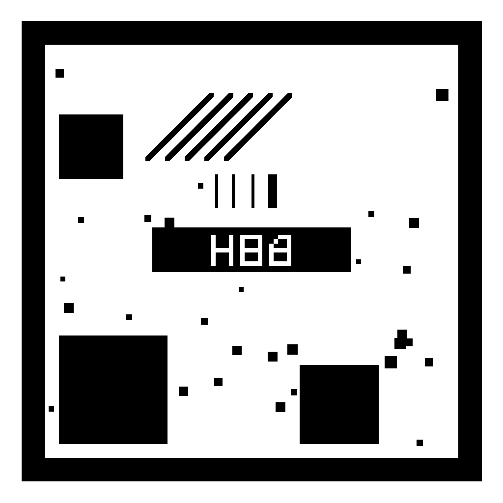

# Semana 6 — Demostración AR del elemento estructural FE (tag 489) y primera compilación APK

> **Rama:** `semana-06-ar`
> **Versión del editor:** Unity 6000.5.10f1 — render pipeline built-in
> **Fecha de la evidencia:** 29 de septiembre de 2026

## 1. Estado de la entrega

**Estado: compilación Android y validación estática del APK completadas. La instalación y demostración física con cámara/ARCore quedan pendientes para la sesión en vivo.**

En esta semana se implementó la representación en Realidad Aumentada (AR) de un elemento estructural de la malla exportada: la viga `EII_CP2_V_029` (tag FE `489`) del Edificio II, junto con la lectura local del resultado de esfuerzo del caso `G` (`Vz`). El flujo de AR quedó implementado y compilado en un APK Android con escena única, y el contenido del APK fue validado estáticamente (manifest, escena única, librerías ARCore/IL2CPP e inclusión del JSON de resultados).

La prueba física en teléfono **todavía está pendiente** porque no se dispone de un dispositivo Android compatible conectado en este entorno de trabajo. Este documento no reporta ninguna verificación física con cámara o tracking; eso se realizará en la sesión en vivo.

## 2. Requisitos de Semana 6

| Requisito | Implementación en Unity | Estado |
|---|---|---|
| Iniciar sesión AR | Componente `ARSession` en la escena `ARMain` | Implementado y compilado |
| Detectar imagen de referencia | `ARTrackedImageManager` + librería de imágenes de referencia con `REF_EII_CP2_V_029` | Implementado y compilado |
| Obtener pose de la imagen | `ARTrackedImage.transform` (rotación y traslación del marcador detectado) | Implementado y compilado |
| Crear anchor persistente | `ARAnchorManager.TryAddAnchorAsync` sobre la pose detectada | Implementado y compilado |
| Transformación de coordenadas | Conversión OpenSees → Unity: `(x,y,z) = (u, cota, v)` y del espacio local al anchor (`T_anchor × local`) | Implementado y compilado |
| Mostrar elemento estructural | Viga `EII_CP2_V_029` como primitivo con las dimensiones de la sección `V.30/80` a escala `1:10` | Implementado y compilado |
| Usar el mismo tag FE | Tag `489` leído desde el JSON en `StreamingAssets` | Implementado y compilado |
| Mostrar el resultado | Caso `G`, `Vz_i` y `Vz_j` del vector de fuerzas del tag `489` | Implementado y compilado |
| Verificación en dispositivo | Instalación, tracking del marcador y estabilidad del anchor en un teléfono Android | **Pendiente de comprobación física** |

## 3. Elemento mostrado

El elemento representado en AR es el tag FE 489 de la malla del Edificio II:

| Propiedad | Valor |
|---|---|
| Edificio | II |
| Tag FE (OpenSees) | `489` |
| Viewer ID | `EII_CP2_V_029` |
| Tipo | viga |
| Sección | `V.30/80` (ancho 0.30 m, peralte 0.80 m) |
| Nivel | `EII_CP2` |
| Punto inicial `p_i` | `(-3.35, 3.91, 4.265)` |
| Punto final `p_j` | `(-0.30, 3.91, 4.265)` |
| Longitud real | `3.05 m` |
| Escala de la escena AR | `1:10` |
| Longitud AR | `0.305 m` |
| Dimensiones de la viga AR | `0.03 × 0.08 m` (sección escalada) |

La viga se construye como un cubo único centrado entre `p_i` y `p_j`, con su etiqueta de identidad (`489 / EII_CP2_V_029`), lo que permite verificar el elemento esperado bajo el marcador.

## 4. Resultado OpenSees presentado

Se presenta el esfuerzo `Vz` (cortante en el plano vertical) del caso **`G`** (peso propio) para el tag `489`.

Vector real de fuerzas del caso `G` (12 componentes, con los índices relevantes marcados):

```text
[ 0, 0, +53.035246, -48.63412, -21.504977, 0, -0, -0, -53.035246, +48.63412, -140.252523, 0 ]
                idx 2 (=Vz_i)                          idx 8 (=Vz_j)
```

| Componente | Índice en el vector | Valor |
|---|---|---|
| `Vz_i` | 2 | `+53.035246 kN` |
| `Vz_j` | 8 | `-53.035246 kN` |

El rótulo AR muestra, redondeado al milésimo: `Vz(i): +53.035 kN` y `Vz(j): -53.035 kN`.

Es importante aclarar que **OpenSees calculó previamente los esfuerzos** (modelo estructural, geometría, casos y combinaciones); el teléfono solo **lee** el JSON y **presenta** el valor correspondiente. La aplicación no recalcula ningún esfuerzo: embebe el dato ya calculado.

## 5. Coordenadas y registro espacial

El flujo de transformación es el siguiente:

```text
OpenSees:  (u, cota, v)
Unity:     (x, y, z) = (u, cota, v)
local:     escala × (p - p_i)
AR:        T_anchor × local
```

- **Origen del sector:** el punto `p_i` del elemento actúa como origen local; cada vértice se desplaza por `(p - p_i)`.
- **Escala:** `0.10` (factor 1:10 manteniendo proporciones reales del elemento y su rótulo).
- **Rotación y traslación:** provienen de la **pose de la imagen detectada** (`ARTrackedImage.transform`): la viga y su rótulo se ubican rotados y trasladados según la posición/orientación real del marcador.
- **Anchor persistente:** sobre la pose se crea un `ARAnchor`; si el marcador se pierde momentáneamente de vista, el contenido **permanece anclado** en el espacio (no se reubica por el último `TrackedImage` visto).

## 6. Qué corre en el teléfono

En el dispositivo Android se ejecutan estos procesos:

1. **ARCore** inicializa la sesión de realidad aumentada (`ARSession`).
2. **Detección de imagen** mediante `ARTrackedImageManager` y el marcador `REF_EII_CP2_V_029`.
3. **Pose y anchor**: se obtiene la pose del marcador y se crea el anchor persistente.
4. **Lectura local del JSON** desde `StreamingAssets` (`lab_data/edificios/II/results/esfuerzos_FE_EDIFICIO_II.json`).
5. **Creación de la geometría** de la viga a escala 1:10 anclada a la pose.
6. **Presentación del resultado**: se lee el vector del caso `G` y se muestra `Vz_i` / `Vz_j` en un rótulo.
7. **Billboard**: el rótulo se orienta siempre hacia la cámara (billboard en `LateUpdate`), legible en cualquier ángulo.

## 7. Qué fue calculado previamente

El siguiente trabajo se realizó en fases anteriores y **no se recalcula en el teléfono**:

- **Modelo OpenSees** del Edificio II (MAT/TCL) con su geometría y conectividad.
- **Geometría analítica** de elementos y niveles (puntos `p_i`/`p_j`, secciones, `cota`).
- **Casos y combinaciones** de carga (G, Q, EX, EY, y combinaciones U*).
- **Vector de fuerzas** por elemento y caso (los 12 componentes por barra).
- **Correspondencia tag ↔ viewer**: el `tag` FE de OpenSees (489) con el `viewer_id` (`EII_CP2_V_029`).
- **Generación del JSON** de resultados exportado a `StreamingAssets`.

El teléfono se limita a leer este JSON y presentarlo, lo que hace el diseño extensible: sustituyendo el JSON y la biblioteca de imágenes se puede mostrar otro elemento sin cambiar la lógica AR.

## 8. Marcador de referencia

| Propiedad | Valor |
|---|---|
| Nombre de imagen de referencia | `REF_EII_CP2_V_029` |
| Tamaño físico | `0.30 × 0.30 m` |
| Archivo de imagen | `viewer_unity/Assets/AR/ReferenceImages/marker_489.png` |
| Biblioteca de imágenes | `viewer_unity/Assets/AR/ReferenceImages/AR_REF_489.asset` |

**Instrucciones de impresión:** imprimir a **30 × 30 cm**, escala **100 %** (sin ajustar al tamaño de página), preferentemente en **papel mate** para evitar reflejos que dificulten la detección por la cámara.



## 9. APK generado

| Propiedad | Valor |
|---|---|
| Nombre | `lab-viewer-AR-tag489.apk` |
| Tamaño | `83 548 680` bytes (~79.7 MB) |
| SHA256 | `FD7DA35FEA8BCB350A1EBF131576FF537C0E9B0A3761537A5590AF9A4A5CBB83` |
| Package identifier | `com.grupo8.labviewer.artag489` |
| Versión / versionCode | `1.0` / `1` |
| minSdk | **29** (Android API 29+) |
| targetSdk | `36` |
| ABI | `ARMv7` (`armeabi-v7a`) y `ARM64` (`arm64-v8a`) |
| ARCore | Integrado e incluido entre los requisitos de la app (librerías ARCore presentes, meta-data `com.google.ar.core` en el manifest) |
| Permiso | `android.permission.CAMERA` (además de `INTERNET`) |
| Backend de scripting | IL2CPP |
| Escena | Única: `Assets/Scenes/ARMain.unity` (`level0`) |

**Enlace de descarga previsto:**

```text
https://github.com/Jo-18/P1-Grupo-8/releases/download/semana-06-ar-v1/lab-viewer-AR-tag489.apk
```

> Nota: el enlace funcionará **después de publicar** la GitHub Release `semana-06-ar-v1` con el APK adjunto. El APK no se copia dentro del repositorio; la publicación se hará posteriormente.

## 10. Instalación y prueba futura

Con un teléfono compatible conectado (depuración USB habilitada):

```text
adb install -r lab-viewer-AR-tag489.apk
```

Flujo esperado de la demostración en vivo:

1. Abrir la aplicación.
2. Conceder el permiso de cámara.
3. Apuntar la cámara al marcador impreso (30 × 30 cm).
4. Verificar que aparecen la viga y el rótulo con `Vz(i)`/`Vz(j)`.
5. Mover el teléfono y comprobar que el contenido sigue la posición real.
6. Ocultar momentáneamente el marcador (giro o tapa).
7. Comprobar que el anchor mantiene el contenido estable en el lugar correcto.

## 11. Evidencia del build

| Ítem | Valor |
|---|---|
| Editor | Unity `6000.5.10f1` |
| Resultado del `BuildReport` | `Succeeded` |
| Errores | `0` |
| Warnings | `14` (aviso de serialización CS0618/CS0414 del proyecto y avisos del toolchain) |
| Duración | `215.7 s` |
| Fecha de la ejecución | 29 de septiembre de 2026 |
| SHA256 del APK | `FD7DA35FEA8BCB350A1EBF131576FF537C0E9B0A3761537A5590AF9A4A5CBB83` |
| Manifest (aapt) | package `com.grupo8.labviewer.artag489`, minSdk 29, targetSdk 36, permiso `CAMERA`, `INTERNET`, meta-data ARCore `com.google.ar.core`, `uses-feature` AR, ABI `arm64-v8a`/`armeabi-v7a` |
| JSON dentro del APK | `assets/lab_data/edificios/II/results/esfuerzos_FE_EDIFICIO_II.json` presente |
| Librerías ARCore | `lib/arm64-v8a/libUnityARCore.so`, `libarcore_sdk_c.so`, `libarcore_sdk_jni.so` |
| IL2CPP | `lib/arm64-v8a/libil2cpp.so` + `Managed/Metadata/global-metadata.dat` |
| Escena inicial | Única (`level0`, sin `level1`) |

## 12. Limitaciones

- **Falta la prueba física**: no se ha verificado el tracking, la proyección del contenido ni la estabilidad del anchor en un dispositivo Android real; esa comprobación queda para la sesión en vivo.
- **Dispositivo requerido**: teléfono compatible con **ARCore** y con **Android API 29 o superior**.
- **Primera versión acotada**: la escena AR muestra **un solo elemento** (tag 489) y **un solo resultado** (caso `G`, `Vz`).
- **Extensible**: el diseño permite **reemplazar el JSON y la biblioteca de imágenes** para mostrar otros elementos/resultados sin cambiar la lógica AR.

## 13. Diagramas internos reales del tag 489 (persistencia)

Junto al vector de esfuerzos se persisten los **diagramas internos exactos** del
elemento `489` para el caso `G` en:

```text
viewer_unity/Assets/StreamingAssets/lab_data/edificios/II/results/
diagramas_FE_tag489_G.json
```

(51 estaciones entre `x=0` y `x=3.05` m; `N=0`, `Vy=0`, `Vz=+53.035246 kN`
constante, `T=-48.634120 kN·m` constante, `My=-21.504977+53.035246·x kN·m`,
`Mz=0`; en `x=L`: `My=+140.252523 kN·m=-My_j`; 20 comprobaciones OK). El
generador reproducible es
`entrega_03_cargas_sismo_capacidad/src/unity_esfuerzos/exportar_diagrama_ar_tag489.py`
(ver nota de procedencia en el propio JSON).

> **Procedencia (importante):**
> - Los diagramas corresponden al snapshot FE del Edificio II de **258 elementos**
>   que consume la aplicación (`esfuerzos_FE_EDIFICIO_II.json`).
> - El generador general actual del repositorio **todavía no reproduce esa
>   topología**: el modelo regenerado hoy tiene **253 elementos** y excluye la
>   viga de junta `EII_CP2_V_029` (`PENDIENTE_DE_FUENTE`).
> - Este JSON **no es** resultado de una regeneración actual del modelo completo;
>   su `payload_fuente.sha256` fija la procedencia y el generador aborta si el
>   payload canónico cambia o falla cualquier condición de validación.