# Informe final — Proyecto 1 · Grupo 8

**Integrantes:**
- Josefa Loyola
- Javiera Mosqueira
- Josefina Muro

**MCOC · Edificio G35: análisis en OpenSees, Unity como pre y postprocesador y realidad aumentada**


> **Estado del documento.** Faltan las capturas del viewer de las figuras 1, 2, 4, 5, 9, 10 y 12 a 18, y dos de las tres de la app AR (figura 19): ver el Anexo B. La APK oficial FIX03 (versión 0.5.3, código 109) fue probada y aprobada por el grupo en el teléfono (sección 16); esa prueba no se repitió al integrar el proyecto. Las combinaciones C1 a C3 están pendientes de confirmar con el enunciado o el profesor (sección 7). El QA, la sensibilidad y el Excel de esfuerzos siguen pendientes de repetirse con OpenSees real (sección 18). La integración del Unity de la entrega con el de Honors se verificó el 7 de octubre de 2026: 51 pruebas Python/OpenSees, 64/64 de Unity EditMode y 23/23 de Unity PlayMode aprobadas (sección 18). El viewer de Windows no se regeneró después de esa integración.

<!--
PENDIENTE ANTES DE ENTREGAR (borrar este bloque al terminar):
1. Completar integrantes, enlace y commit en la tabla de arriba.
2. Generar desde el Editor de Unity las capturas pendientes del Anexo B (carpeta reports/img/demo/) y volver a insertarlas en el cuerpo. No se necesita ejecutable.
3. AR: la app ya se probó en el teléfono. Faltan las capturas de los modos 1:1 y sobre plano (reports/img/ar/).
4. Volver a correr con OpenSees real qa_semana06.py, sensibilidad_rigidez.py y exportar_excel_esfuerzos.py (siguen pendientes). El JSON principal y pytest ya se hicieron con OpenSees real; tras integrar Honors, pytest se repitió con 51 casos (secciones 18 y 22).
5. Confirmar las combinaciones C1 a C3 con el enunciado o el profesor (sección 7).
6. Completar la sección 21 (cada integrante) y "otros usos de IA" de la sección 20.
-->

## 1. Resumen

El proyecto modela dos edificios de hormigón armado G35, con perfiles metálicos A36 en una zona en voladizo, separados por una junta de dilatación. La geometría sale de los planos estructurales (DXF) y se guarda como datos JSON. Con esos datos, Python arma el modelo en OpenSeesPy, resuelve los casos G, Q, EX y EY y las combinaciones C1 a C3 (factores pendientes de confirmar, sección 7), calcula la capacidad según ACI 318-19 y exporta todo a un JSON que lee Unity.

Unity funciona como postprocesador: muestra geometría, apoyos, ejes, diafragmas, cargas, diagramas, deformada, curvas P-M y utilización. También funciona como preprocesador: desde la interfaz se cambian parámetros, combinaciones, armaduras y secciones, y se reanaliza llamando a Python. El proyecto incluye una app Android de realidad aumentada que ancla el modelo y sus resultados a un marcador impreso. El grupo la probó en el teléfono y funciona (sección 16).

Flujo: **planos → datos (JSON) → OpenSees → resultados (JSON) → Unity → AR**.

Resultados principales del modelo vigente. El JSON de resultados se regeneró con OpenSees real (OpenSeesPy 3.8.0.0, Python 3.12.10); las diferencias con la versión anterior, hecha con la réplica de verificación, son de redondeo (sección 18):

- **Cargas gravitacionales:** G = 75 701 kN y Q = 25 886 kN, ambas iguales a la suma de reacciones.
- **Sismo (NCh433 estático):** corte basal de 9 483 kN en X y 7 798 kN en Y. Por edificio y dirección queda entre −7 % y +2 % del modelo ETABS de referencia, y los períodos entre −8 % y +7 % (sección 8).
- **Desplazamientos:** máximo de 32,6 mm con EY y de 31,9 mm en la combinación más desfavorable (C2). La deriva máxima en el centro de masa es 0,00146, bajo el límite de 0,002 de la NCh433.
- **Columnas de hormigón:** ninguna supera su capacidad (DCR máximo 0,41).
- **Vigas:** ninguna supera su capacidad, después de completar su armadura (el documento no la trae).
- **Muros:** con su armadura de borde, ninguno supera su capacidad (C máximo 0,20).
- **Armadura:** la de columnas y muros sale del documento de armaduras del grupo, completada con supuestos y revisada con ACI 318-19 (secciones 12 y 19).

Estos resultados y sus límites se discuten en las secciones 8, 12 y 19.

**Alcance de esta versión.** Esta versión del sistema (modelo, scripts de análisis, viewer de Unity y app AR) incluye los siguientes puntos de trabajo del grupo 8:

- la identidad del proyecto y de las apps;
- la paleta visual, el suelo de pasto y paneles que se pueden mover y redimensionar;
- la armadura de columnas y muros, según el documento de armaduras del grupo;
- la verificación de los resultados;
- las figuras reproducibles y la documentación de esta entrega.

El detalle de lo que hizo cada integrante y de lo que se hizo con IA está en las secciones 20 y 21.

## 2. Edificio e idealización

Son dos edificios de hormigón armado con marcos de vigas y columnas, muros y losas. Están separados por una junta de dilatación en la línea x = −10 m y no comparten nodos, así que trabajan de forma independiente.

El edificio 1 sale de los planos 2017_67 y el edificio 2 de los planos 2024_22. Ambos tienen un subterráneo y cuatro pisos sobre el nivel 0, con altura de piso de 3,96 m. En la zona en voladizo del edificio 1 hay pilares y arriostres metálicos.

| Material | Uso | Propiedades en el modelo |
|---|---|---|
| Hormigón G35 | vigas, columnas, muros y losas | f'c = 35 MPa; E = 4700 √f'c = 27 806 MPa; ν = 0,20; γ = 25 kN/m³ |
| Acero A630-420H | armaduras | fy = 420 MPa; Es = 200 GPa |
| Acero A36 | pilares P.M. 300x300x20 y arriostres V.M. 300x300x5 | E = 200 GPa; ν = 0,30; γ = 78,5 kN/m³ |

**Idealización**

- **Elementos:** `elasticBeamColumn` en 3D para vigas, columnas, arriostres y brazos rígidos, y `ElasticTimoshenkoBeam` para los muros, que incluye la deformación por corte. Hay 6 grados de libertad por nodo. Las fuerzas internas se guardan en ejes locales, con 12 componentes por elemento (N, Vy, Vz, T, My y Mz en cada extremo).
- **Muros:** cada paño de un piso es una columna ancha equivalente (A = t·L e I = t·L³/12 en el plano), con deformación por corte (área de corte 5/6 A), como los muros shell de ETABS. Se une por brazos rígidos a los nodos del marco que están sobre la línea del muro. En total hay 91 paños y 395 brazos rígidos.
- **Losas:** no se modelan como placas. Reparten la carga a vigas y brazos de muro mediante áreas tributarias e imponen un diafragma rígido por piso y por edificio, con el nodo maestro en el centro de masa.
- **Apoyos:** empotrados en la base.
- **Rigidez:** 0,35 Ig en vigas y 0,70 Ig en columnas (ACI 318-19, 6.6.3.1.1). Los muros llevan su inercia bruta (1,0 Ig): con 0,35 Ig el edificio 2 quedaba mucho más flexible que el modelo ETABS de referencia (sección 8).
- **Análisis:** estático lineal. Cada caso se resuelve una vez y las combinaciones se obtienen por superposición.

## 3. Geometría y datos

La geometría se tomó de los planos DXF y se guardó en `Proyecto1/data/estructura_completo_unity.json`.

El script `ajustar_modelo_planos.py` parte siempre del respaldo `estructura_completo_unity.pre_planos.json`. Aplica 16 correcciones detectadas al superponer plantas y elevaciones con el modelo, y se puede correr varias veces sin duplicar cambios. Las principales son:

- el reflejo en Y del edificio 2 respecto del plano 2024_22;
- la altura de piso de 3,96 m y el subterráneo del edificio 2 hasta el radier;
- los muros faltantes y los espesores del núcleo norte del edificio 1;
- los pilares metálicos y arriostres de las elevaciones 2017_67-800/801/802, incluido E1_255;
- las vigas partidas donde una secundaria llegaba sin nodo común;
- las losas en voladizo, cuya área se suma a las vigas de borde;
- los muros como columna ancha (paso 14) y el reparto tributario recalculado desde las losas (paso 16).

| Ítem | Cantidad |
|---|---|
| Nodos | 718 |
| Elementos | 1 023 |
| Vigas | 398 (V60/80: 367 · V40/80: 15 · V30/80: 10 · V40/60: 4 · V30/45: 2) |
| Columnas | 129 (118 COL70/70 de hormigón y 11 pilares metálicos P.M. 300x300x20) |
| Arriostres | 10 (V.M. 300x300x5) |
| Muros como columna ancha | 91 paños |
| Brazos rígidos | 395 |
| Paneles de losa | 239 |
| Apoyos empotrados | 74 (62 en z = −3,96 m y 12 en z = 0) |
| Diafragmas rígidos | 10: uno por nivel (5) en cada edificio (2), definidos en `carga_viva_sismo.diaphragm_groups` |
| Niveles | −3,96 / 0 / 3,96 / 7,92 / 11,88 / 15,84 m (z = 0 en el cielo del subterráneo, CIELO_1S) |

| Archivo (`Proyecto1/data/`) | Contenido |
|---|---|
| `estructura_completo_unity.json` | modelo: nodos, elementos, losas, apoyos y áreas tributarias |
| `estructura_completo_unity.pre_planos.json` | respaldo previo a los ajustes a planos |
| `parametros_analisis.json` | q_G, Q, Q de cubierta, sismo, rigidez fisurada y cambios de sección |
| `combinaciones.json` | factores λ de C1, C2 y C3 |
| `armaduras.json` | armadura de vigas, columnas (tipo y excepciones por elemento) y muros, con sus supuestos |
| `ejes_grilla.json` | ejes de grilla leídos de los DXF |

Las unidades son kN, m y kN·m. Los desplazamientos se muestran en mm.

## 4. Cargas gravitacionales y áreas tributarias

La carga muerta G suma la losa tributaria y el peso propio de los elementos:

- **Losa:** q_G = 6,227 kN/m² sobre el área tributaria de cada viga o brazo de muro. Incluye el peso de la losa de 0,15 m (3,75 kN/m²) y el resto de las cargas permanentes.
- **Peso propio:** vigas, columnas, arriostres y muros, con 25 kN/m³ para el hormigón y 78,5 kN/m³ para el acero. En las vigas se descuenta la franja que ya está dentro de la losa.
- **Aplicación:** ambas partes se aplican como carga repartida sobre cada elemento (`eleLoad -beamUniform`). Así OpenSees considera los momentos de empotramiento.

**Reparto tributario.** Las áreas se reparten desde las losas con el método b/a. Cada borde de losa carga las vigas o brazos de muro que lo cubren, y la parte de un borde libre pasa a los bordes apoyados del mismo panel. La suma de las áreas tributarias de los elementos es 6 136,8 m², lo que da q_G · ΣA = 38 215 kN de losa.

**Resultado:** G = 75 700,9 kN, igual a ΣRz con un error menor que 10⁻⁶ kN.

El resumen por piso que muestra la pestaña VISTA no coincide con este reparto (sección 19). Para revisar áreas tributarias conviene seleccionar el elemento, que muestra el área y la carga que usa el análisis.

## 5. Carga viva

- **Pisos:** Q = 500 kg/m² = 4,903 kN/m².
- **Cubierta:** 200 kg/m² en el nivel superior de cada edificio, que es una losa no accesible. La NCh1537 exige al menos 100 kg/m² en techos.
- **Aplicación:** Q = q · A_trib, repartida sobre cada viga o brazo de muro, con las mismas áreas tributarias de la carga muerta.
- **Resultado:** Q total = 25 885,9 kN, igual a ΣRz.

En el peso sísmico la carga viva entra con un 25 % (P = D + 0,25Q). El valor de Q se puede cambiar desde la pestaña ANÁLISIS de Unity o con `--q-kg-m2` en el exportador.

## 6. Sismo pseudoestático

Se usa el método estático de la NCh433 Of.96 Mod.2009, con el DS61:

- zona 3 (A0 = 0,40 g);
- suelo C (S = 1,05, T' = 0,45 s, n = 1,40);
- R = 7 e I = 1,0;
- peso sísmico P = D + 0,25Q.

El coeficiente sísmico es:

C = 2,75 · S · A0 / (g · R) · (T' / T*)ⁿ, con C_min = S · A0 / (6g) = 0,070 ≤ C ≤ C_max = 0,35 · S · A0 / g = 0,147.

T* es el período del modo con mayor masa traslacional en cada dirección. Se obtiene de un análisis modal de cada edificio con masa (D + 0,25Q)/g.

| | Edificio 1 | Edificio 2 |
|---|---|---|
| P = D + 0,25Q [kN] | 45 898 | 34 678 |
| T* en X / en Y [s] | 0,436 / 0,685 | 0,762 / 0,627 |
| C en X | 0,147 (= C_max) | 0,079 |
| C en Y | 0,092 | 0,104 |
| Q0 = C · I · P en X [kN] | 6 747 | 2 736 |
| Q0 en Y [kN] | 4 203 | 3 595 |

**Reparto en altura.** El corte se reparte con F_k = A_k · P_k / Σ(A_j · P_j) · Q0, donde A_k = √(1 − Z_(k−1)/H) − √(1 − Z_k/H). Las alturas se miden desde la base (z = −3,96 m), con H = 19,8 m. Cada fuerza se aplica en el nodo maestro del diafragma de su piso y edificio.

| Nivel | z [m] | A_k | Edificio 1, F_EX [kN] | Edificio 1, F_EY [kN] | Edificio 2, F_EX [kN] | Edificio 2, F_EY [kN] |
|---|---|---|---|---|---|---|
| CIELO_1S | 0,00 | 0,106 | 278,9 | 173,7 | 317,7 | 417,5 |
| CIELO_1 | 3,96 | 0,120 | 887,4 | 552,8 | 360,7 | 473,9 |
| CIELO_2 | 7,92 | 0,142 | 1 040,0 | 647,8 | 427,8 | 562,2 |
| CIELO_3 | 11,88 | 0,185 | 1 506,4 | 938,4 | 557,5 | 732,6 |
| CIELO_4 | 15,84 | 0,447 | 3 034,3 | 1 890,2 | 1 072,4 | 1 409,2 |
| **Σ** | | **1,000** | **6 747,0** | **4 202,9** | **2 736,2** | **3 595,4** |

**Corte basal total:**

- EX = 6 747 + 2 736 = 9 483 kN (C equivalente 0,118 respecto del peso total).
- EY = 4 203 + 3 595 = 7 798 kN (C equivalente 0,097).

En X el edificio 1 queda limitado por C_max, porque su período es corto. En el edificio 2, C sale de la fórmula en ambas direcciones.

El criterio de las semanas anteriores, C fijo con F = C (D + 0,5Q), sigue disponible con la opción `--sc` del exportador.

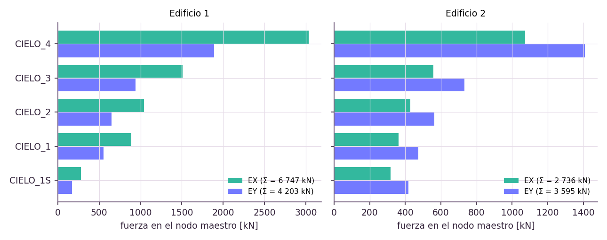

*Figura 3. Fuerzas sísmicas por piso aplicadas en los nodos maestros (generada con `figuras_informe.py`).*

## 7. Superposición

Las combinaciones se leen de `data/combinaciones.json`:

| Combinación | λG | λQ | λEX | λEY |
|---|---|---|---|---|
| C1 | 1,0 | 0,5 | +0,3 | +0,2 |
| C2 | 1,0 | 0,5 | +0,3 | −0,2 |
| C3 | 1,0 | 0,5 | −0,3 | +0,2 |

**Pendiente de confirmación.** Estos factores no tienen respaldo explícito en este repositorio: el campo `origen` de `data/combinaciones.json` los describe como "Factores usados desde la semana 3 del curso (pendiente de confirmar con el enunciado/profesor)". Hasta confirmarlos, C1 a C3 y los resultados por combinación (desplazamientos y DCR) dependen de factores provisionales.

Como el modelo es lineal, cada combinación es exactamente Σ λ_i · (caso i). El exportador también corre C1 a C3 directamente en OpenSees. `verificar_superposicion.py` y el QA comprueban que ambos caminos dan lo mismo, con un error máximo del orden de 10⁻⁹.

En Unity, la *superposición en vivo* de la pestaña RESULTADOS tiene cuatro deslizadores (λG, λQ, λEX, λEY). Combina los resultados de los casos base sin reanalizar, así que el efecto de cada factor se ve al instante.
Lo que cambia en vivo:
- la deformada;
- los diagramas;
- los valores del elemento seleccionado;
- el punto de demanda del panel P-M.

**Verificación de tres estados.** Se compararon tres estados de los deslizadores con una corrida directa del modelo con esas cargas, usando `superposition_check_multi`:
- *Valor de Unity:* lo que muestra Unity es Σλ·caso, en el nodo de control 492.
- *Error:* la diferencia máxima entre la corrida directa y la superposición.

| Estado | λG / λQ / λEX / λEY | ux / uy / uz del nodo 492 en Unity [mm] | Error máx en reacciones | Error máx en fuerzas y desplazamientos |
|---|---|---|---|---|
| S1 = C1 | 1 / 0,5 / 0,3 / 0,2 | 7,60 / 5,42 / −1,01 | 6,5 · 10⁻⁹ kN | < 10⁻¹³ |
| S2 = estado de la figura 4 (captura pendiente) | 1 / 0,5 / 1 / 0,3 | 22,11 / 6,02 / −0,87 | 9,3 · 10⁻⁹ kN | < 10⁻¹³ |
| S3 = captura del grupo | 0,6 / 1 / 1 / 1 | 25,35 / 27,50 / −2,65 | 2,8 · 10⁻⁸ kN | < 10⁻¹³ |

En los tres estados la superposición coincide con la corrida directa a precisión de máquina.

## 8. Análisis global y verificaciones

Cada caso se resuelve con un análisis estático lineal en OpenSees (`carga_viva_sismo.py`, que también usan el exportador, los tests y Unity).

| Caso | Carga aplicada [kN] | Reacción [kN] | Diferencia [kN] |
|---|---|---|---|
| G (vertical) | 75 700,94 | 75 700,94 | < 10⁻⁶ |
| Q (vertical) | 25 885,86 | 25 885,86 | < 10⁻⁶ |
| EX (horizontal) | 9 483,2 | 9 483,2 | < 10⁻⁵ |
| EY (horizontal) | 7 798,3 | 7 798,3 | < 10⁻⁵ |

| Caso o combinación | G | Q | EX | EY | C1 | C2 | C3 |
|---|---|---|---|---|---|---|---|
| \|u\| máximo [mm] | 25,8 | 10,6 | 21,5 | 32,6 | 31,5 | 31,9 | 31,7 |

Estas dos tablas coinciden con el JSON regenerado con OpenSees real (OpenSeesPy 3.8.0.0, Python 3.12.10): las reacciones difieren menos de 10⁻⁶ kN y el desplazamiento máximo menos de 10⁻⁶ mm respecto de la versión con réplica.

**Sensibilidad a la rigidez.** *Pendiente: esta tabla se generó con la réplica de verificación y debe repetirse con OpenSees real.* `sensibilidad_rigidez.py` compara la sección bruta, la rigidez fisurada vigente y una variante con muros no fisurados:

| Rigidez | u máx EX [mm] | u máx EY [mm] | Deriva máx EX | Deriva máx EY | Corte en muros EX / EY | C máx columnas | C máx muros |
|---|---|---|---|---|---|---|---|
| Sección bruta | 18,4 | 27,4 | 0,00108 | 0,00174 | 91 % / 97 % | 0,40 | 0,20 |
| ACI fisurada (muros 0,35 Ig) | 22,5 | 36,6 | 0,00133 | 0,00231 | 95 % / 99 % | 0,39 | 0,12 |
| Muros con 0,70 Ig | 21,3 | 32,7 | 0,00129 | 0,00211 | 96 % / 100 % | 0,38 | 0,17 |
| **Vigente: muros con 1,0 Ig** | 21,2 | 30,6 | 0,00129 | 0,00202 | 96 % / 100 % | 0,38 | 0,20 |

- **Corte en muros:** los muros toman prácticamente todo el corte sísmico. Un valor sobre 100 % indica que los marcos trabajan en sentido contrario.
- **Deriva en el centro de masa (NCh433 5.9.2):** la máxima es 0,00146 (edificio 1, EY), medida en el nodo maestro de cada diafragma. Queda bajo el límite de 0,002. La verifica `qa_semana06.py` (bloque `derivas_NCh433`).
- **Deriva en cualquier punto (NCh433 5.9.3):** la mayor, medida en columnas y muros, es 0,00202 (edificio 2, EY). Queda bajo la deriva en el centro de masa más 0,001 (0,00138 + 0,001).

### Comparación con los modelos ETABS de referencia (LT1 y LT2)

El profesor entregó resultados de dos modelos ETABS hechos por un estudiante de doctorado:

- **LT1:** la parte antigua del edificio, que corresponde a nuestro edificio 1 (planos 2017_67).
- **LT2:** la parte nueva, que corresponde a nuestro edificio 2 (planos 2024_22).

No se espera que los valores sean iguales, sino similares. Las unidades de ETABS se convirtieron: N a kN y N·mm a kN·m.

| Magnitud | LT1 (ETABS) | Edificio 1 | Diferencia | LT2 (ETABS) | Edificio 2 | Diferencia |
|---|---|---|---|---|---|---|
| Carga muerta CM / G [kN] | 47 140 | 43 158 | −8,4 % | 34 723 | 32 543 | −6,3 % |
| Sobrecarga CV / Q [kN] | 11 620 | 14 672 | +26,3 % | 11 097 | 11 214 | +1,1 % |
| Período en X [s] | 0,475 | 0,436 | −8,2 % | 0,735 | 0,762 | +3,7 % |
| Período en Y [s] | 0,640 | 0,685 | +7,1 % | 0,628 | 0,627 | −0,1 % |
| Corte basal EX [kN] | 6 594 | 6 747 | +2,3 % | 2 953 | 2 736 | −7,3 % |
| Corte basal EY [kN] | 4 331 | 4 203 | −3,0 % | 3 681 | 3 595 | −2,3 % |

- **Rigidez de los muros (cambio del modelo):**
  - Con los muros en 0,35 Ig, el edificio 2 quedaba mucho más flexible que LT2. Sus dos primeros modos salían acoplados en diagonal (0,856 s y 0,759 s, con participación en X e Y a la vez).
  - Por eso su sismo quedaba en C_min y el corte basal salía 18 % (X) y 34 % (Y) más bajo que en ETABS.
  - Con la inercia bruta de los muros, los modos se separan como en ETABS: X a 0,762 s, Y a 0,627 s y luego la torsión.
  - Además, los muros incluyen deformación por corte (`ElasticTimoshenkoBeam`), como los elementos shell de ETABS.
  - Con ambos cambios, los cuatro períodos quedan entre −8 % y +7 % y los cuatro cortes basales entre −7 % y +2 % de ETABS.
  - En el análisis sísmico con NCh433 es habitual usar los muros sin fisurar. Vigas y columnas mantienen sus factores de ACI.
- **Período del edificio 1 en X:** sin deformación por corte en los muros quedaba 23 % más corto que en LT1; con ella queda −8,2 %. En ambos modelos C queda en C_max, así que la fuerza no cambia.
- **Cargas:**
  - La carga muerta queda entre 6 % y 8 % bajo ETABS.
  - La sobrecarga del edificio 2 coincide.
  - La del edificio 1 es 26 % mayor. Probablemente se debe a supuestos de uso o de áreas, porque aquí van 500 kg/m² en todos los pisos, incluidos el cielo del subterráneo y el voladizo.
- **Esfuerzos:** los elementos de ETABS no se pueden identificar uno a uno, porque la numeración es distinta, pero los órdenes de magnitud coinciden.
  - La columna C9 de LT1 (piso 1) lleva 3 557 kN de CM; nuestras columnas del piso 1 del edificio 1 llevan entre 343 y 3 265 kN de G.
  - La columna C1 de LT2 lleva 1 994 kN, dentro del rango del edificio 2 (440 a 2 712 kN).
  - La C4 de LT2 (piso 3) lleva 1 596 kN, algo sobre nuestro máximo de ese piso (1 304 kN).
  - Los momentos de las vigas B739 y B189 (100 a 170 kN·m) están dentro de los rangos de nuestras vigas de luz parecida en esos pisos.
- **Diferencias revisadas que no son errores del modelo (sección 19):**
  - *Vigas largas del edificio 2:* en los ejes x = −33,98 y −41,48 m no hay columnas en los datos de los planos. El modelo y el paso 11 de `ajustar_modelo_planos.py` apoyan esas vigas en muros (plano 2024_22). Su flecha con G (unos 25 mm en vigas de cerca de 16 m, con 0,35 Ig) está bajo L/240.
  - *Columnas metálicas del voladizo sur del piso 2:* trabajan como tirantes, porque el arriostre baja desde la punta del voladizo superior hasta el pilar del eje 3 (elevación 2017_67-802). La C21 de ETABS está comprimida con una fuerza parecida (49 kN), lo que sugiere un arriostre en el sentido contrario. Conviene confirmarlo en esa elevación.

## 9. Fiber Sections

**Columna COL70/70.** La sección de fibras se declara en OpenSees (`section Fiber`) con la armadura de la columna habitual del documento de armaduras del grupo:

| Parte | Definición |
|---|---|
| Sección | 0,70 × 0,70 m |
| Hormigón | parche rectangular de 20 × 20 fibras de `Concrete01`: f'c = 35 MPa, ε_c0 = 0,002, f_cu = 0,85 f'c, ε_cu = 0,003 |
| Acero | capas de `Steel01`: fy = 420 MPa, Es = 200 GPa, endurecimiento b = 0,01 |
| Armadura | 16φ28 perimetrales: 5 arriba, 5 abajo y 3 intermedias por costado. A_st = 9 852 mm² (ρ = 2,01 %) |
| Recubrimiento | 40 mm al estribo φ10, con el centro de las barras a 64 mm del borde |

Para la curva M-φ y la P-M por fibras se usa además un integrador propio, que es puro Python y no necesita OpenSees. Tiene la misma sección y las mismas posiciones de barras que la verificación ACI (`capacidad_ha.barras_perimetro`), con ε_cu = 0,0035. Con él se estudia la sensibilidad a la malla (10 × 10, 20 × 20 y 40 × 40 fibras de hormigón).

**Muro de referencia W_DPRIME_OPENING_TO_3:**

| Parte | Definición |
|---|---|
| Dimensiones | t = 0,25 m y L = 7,60 m |
| Hormigón | G35 |
| Armadura | 18φ40 por extremo (filas de 2 cada 150 mm) y malla doble φ10 cada 200 mm como máximo (86 barras, ρ = 2,59 %) |

Su envolvente P-M se calcula por fibras con el mismo criterio de deformación última. El documento no trae un muro de 0,25 × 7,60 m, así que se tomó el número de barras del muro de igual espesor y largo más parecido (0,25 × 7,95 m).

## 10. `M-phi`

**Procedimiento.** Para cada curvatura φ se busca la deformación del eje (ε0) que equilibra el axial P. Luego se integra el momento sobre las fibras. La curva termina cuando la fibra de hormigón más comprimida llega a ε_cu = 0,0035.

| Malla | M_max [kN·m] | φ en M_max [1/m] | EI inicial [kN·m²] |
|---|---|---|---|
| 10 × 10 | 1 279,4 | 0,0312 | 2,126 · 10⁵ |
| 20 × 20 | 1 287,4 | 0,0328 | 2,138 · 10⁵ |
| 40 × 40 | 1 287,2 | 0,0324 | 2,141 · 10⁵ |

- **Convergencia:** las mallas 20 × 20 y 40 × 40 difieren en 0,02 % (criterio < 1 %), así que 20 × 20 es suficiente.
- **Forma de la curva (P = 0):**
  - Es lineal hasta φ ≈ 0,0048 1/m (M ≈ 970 kN·m), cuando fluye la fila inferior de 5 barras.
  - Las filas intermedias fluyen cerca de φ ≈ 0,0064 1/m (M ≈ 1 065 kN·m) y φ ≈ 0,0104 1/m (M ≈ 1 165 kN·m).
  - Desde ahí la rama es casi plana, por el endurecimiento de 1 % del acero, hasta que el hormigón llega a ε_cu cerca de φ ≈ 0,033 1/m.
- **Comparación con ACI:** en flexión pura, el bloque de Whitney y la integración de fibras con las mismas hipótesis (acero elastoplástico, ε_cu = 0,003) difieren en 1,1 %. Lo comprueba `test_pm_columna_vs_fibras`.
- **Reproducibilidad:** `figuras_informe.py` usa el mismo integrador y los mismos pasos del QA, y da exactamente los valores de la tabla.

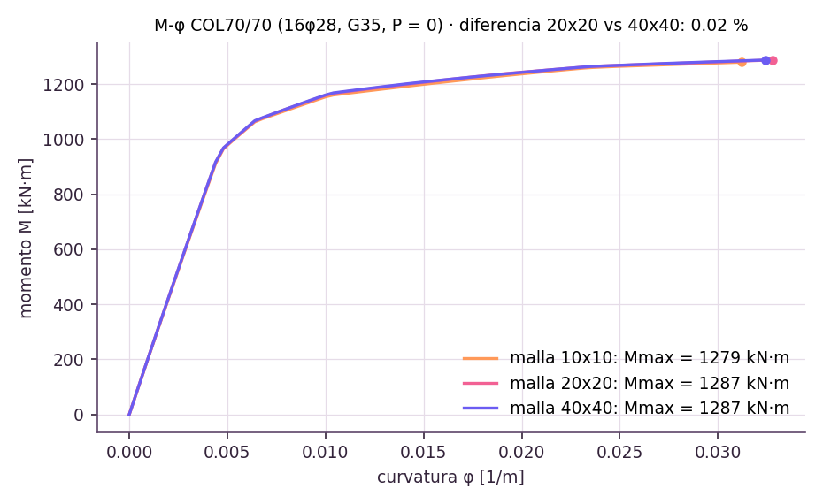

*Figura 6. Curva M-φ de la COL70/70 (16φ28) con las tres mallas.*

## 11. `P-M` columna y muro

**Columnas COL70/70.** La curva de diseño se calcula por compatibilidad de deformaciones según ACI 318-19:

- ε_cu = 0,003 y β1 = 0,80;
- φ entre 0,65 y 0,90 según la deformación del acero en tracción;
- φP_n,max = 0,80 · φ · P0.

Cada barra entra con su diámetro y su posición, así que las armaduras mixtas (φ28 en esquinas y φ36 en caras) quedan bien representadas. El documento define tres armaduras:

| Armadura | Columnas | A_st [mm²] | P0 [kN] | φP_n,max [kN] | Tracción pura φP_nt [kN] |
|---|---|---|---|---|---|
| 16φ28 (habitual) | 100 | 9 852 | 18 422 | 9 580 | -3 724 |
| 4φ28 + 16φ36 (pórtico extremo) | 17 | 18 749 | 21 894 | 11 385 | -7 087 |
| 20φ36 (columna especial) | 1 | 20 358 | 22 522 | 11 712 | -7 695 |

Como referencia también se muestra la curva nominal de 5 puntos de la sección de fibras (16φ28). Es una poligonal simplificada, por eso en algunos tramos queda por dentro de la de diseño:

| Punto | P [kN] | M [kN·m] |
|---|---|---|
| A, compresión pura | 18 422 | 0 |
| B, balance | 7 000 | 2 070 |
| C, falla dúctil | 3 457 | 1 877 |
| D, flexión pura | 0 | 1 214 |
| E, tracción pura | -4 138 | 0 |

**Puntos de demanda.** Cada uno es (P_u, M_u) por columna y combinación. P_u es el axial y M_u la resultante de My y Mz en el extremo más exigido.

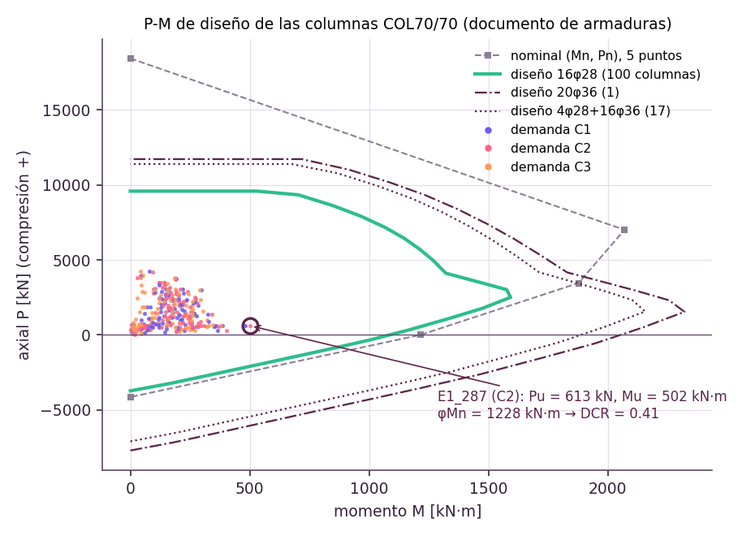

*Figura 7. Curvas P-M de diseño de las tres armaduras de columna, con las demandas C1, C2 y C3 de las columnas con 16φ28 (generada con `figuras_informe.py`).*

**Muros.** Cada uno de los 91 paños tiene la curva de su propia armadura, con la misma formulación ACI de las columnas aplicada al muro en su plano:

- **Bordes:** barras φ40 en cada extremo, en filas de 2 (una por cara), con el número de barras del documento.
  - Las filas van cada 150 mm, sin superar 2t/3 (ACI 318-19 18.10.6.4).
  - En los muros de 0,20 m dos φ40 por fila no caben, así que se usan φ32 con área igual o mayor, en filas cada 130 mm.
- **Alma:** malla doble φ10 cada 200 mm como máximo.

Eso da 19 curvas, una por sección (`W_<t>x<L>_<n>f<φ>`, con t y L en mm).

- **Cuantía total:** entre 1,23 % y 3,95 %.
- **Cuantía local en la zona de borde:** entre 2,82 % y 6,82 %.
- **Origen de la armadura:** 7 secciones están en el documento; para las otras se supuso el número de barras (sección 19).

La demanda de cada muro (P, M en el plano y V por combinación) sale de las fuerzas de su columna ancha en OpenSees.

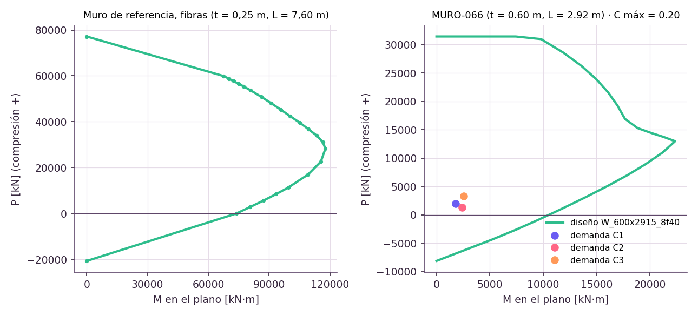

*Figura 8. Envolvente por fibras del muro de referencia (izquierda) y curva de diseño del muro más exigido, MURO-066, con sus demandas (derecha).*

## 12. Demanda-capacidad

`capacidad_ha.py` calcula la capacidad ACI 318-19 con las armaduras de `data/armaduras.json`, para C1, C2 y C3. El factor de uso es DCR = demanda / capacidad, el mayor entre flexión, flexo-compresión y corte.

**Origen de la armadura.** La de columnas y muros sale del documento de armaduras del grupo. Lo que el documento no trae se completó con supuestos, revisando cuantías, separaciones y confinamiento según ACI 318-19 (sección 19).

**Recálculo sin OpenSees.** Las fuerzas no dependen de la armadura, así que no hizo falta volver a correr OpenSees. `actualizar_armadura.py` recalcula la capacidad sobre las fuerzas guardadas. Se comprobó que, con la armadura anterior, reproduce exactamente lo que calcula el exportador.

- **Columnas de hormigón (118):** P-M de diseño y φV_n con V_c según el axial.
  - *Estribos:* el documento da φ10 sin separación. Con 4 ramas, el confinamiento de ACI 318-19 18.7.5.4 exige s ≤ 68 mm, por eso se usa EDφ10a6 en la zona de confinamiento y EDφ10a15 fuera de ella. Con EDφ10a10 no se cumplía.
  - *Cuantías:* 2,01 %, 3,83 % y 4,15 %, dentro del rango de 1 % a 6 %.
  - *Resultado:* el DCR máximo es 0,409, en E1_287 (combinación C2): P_u = 612,9 kN, M_u = 502,1 kN·m y φM_n = 1 228,5 kN·m. El DCR de corte máximo es 0,17.
  - *Otras armaduras:* las del pórtico extremo llegan a 0,15 y la columna especial a 0,22. Ninguna columna supera 1.
- **Vigas (398):** φM_n⁺ con la armadura inferior, φM_n⁻ con la superior más el suple de apoyo, y φV_n = 0,75 (V_c + V_s) con los estribos.
  - *Armadura tipo:* el documento no trae la armadura de vigas, así que se mantuvo la armadura tipo supuesta de los planos. V60/80 subió a 5φ22 y V30/80 a 4φ18, para cumplir la cuantía mínima de ACI 9.6.1.2.
  - *Vigas que no cumplían:* a las 25 vigas que seguían sin cumplir se les asignó la armadura mínima estándar que deja DCR ≤ 1 en una sola capa, con ρ ≤ 2,5 %.
  - *Resultado:* ninguna viga supera 1. La más exigida es E1_56, con DCR = 0,998.
- **Muros (91):** ningún muro supera su capacidad.
  - *Resultado:* el más exigido es MURO-066, con C = 0,20 en C2: P = 1 294 kN, M = 2 416 kN·m y φM_n = 12 011 kN·m.
  - *Antes:* con la malla φ12@200 escalada, 5 muros quedaban fuera de su envolvente por tracción.

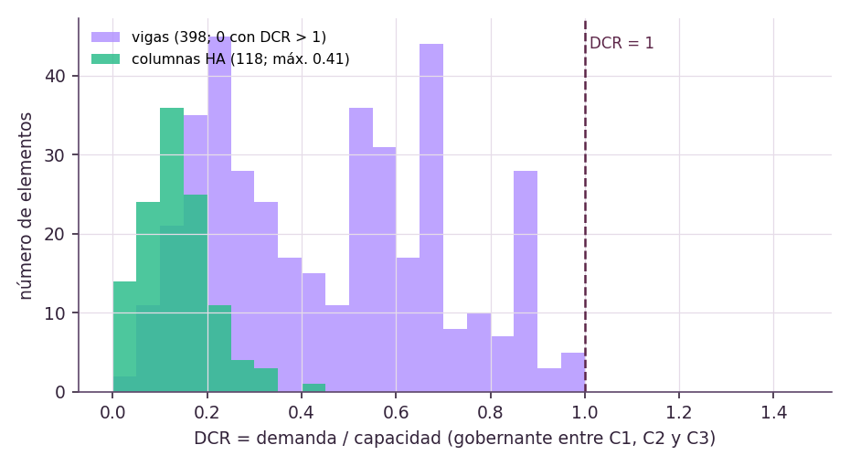

*Figura 11. Distribución del DCR de vigas y columnas de hormigón (generada con `figuras_informe.py`).*

## 13. Unity como pre/postprocesador

El proyecto está en `Proyecto1/edificio_G8` (Unity 6000.6.0f1), en la escena `Assets/Scenes/StructureViewerScene`. Unity no calcula: lee los resultados de `Assets/Resources/estructura_p1l4_unity.json`.

**Postprocesador.** Dibuja el modelo y, para el caso o la combinación activa:

- diagramas;
- deformada;
- curvas P-M con los puntos de demanda;
- utilización por colores;
- propiedades del elemento seleccionado: sección, restricciones, ejes locales, fuerzas, armadura, capacidad y trazabilidad.

**Preprocesador.** En el PC, `PythonJob` lanza `<python> -X utf8 <script> ... --out <archivo temporal>` y luego carga el escenario resultante. Usa el primer Python que tenga openseespy (sección 4.2 del README). Los scripts que usa son:

- el exportador completo;
- `quitar_elemento.py`;
- `carga_movil.py` y `carga_elemento.py`;
- `capacidad_ha.py --merge`, para la armadura.

El escenario queda sin guardar hasta que se elige *Guardar como modelo vigente*, que escribe el JSON de Unity y los archivos de `data/`, o *Descartar*.

Antes de analizar, `validacion_entradas.py` revisa las entradas. Si algo no es válido, el proceso termina con código 2 y Unity muestra el mensaje en la pestaña ANÁLISIS. Además, `AnalysisSession.ValidateInputs` revisa en Unity, antes de lanzar Python, que q_G, Q y Q de cubierta sean números válidos y no negativos; si no lo son, no se ejecuta OpenSees, no se carga ningún escenario y se conservan los últimos resultados válidos (sección 22, H4).

En el teléfono el viewer es de solo lectura: usa los resultados que van dentro del APK.

**Interfaz**

- *Barra superior:* caso o combinación, resultado, buscador por id o tag y cámaras ISO, TOP, FRONT y RIGHT.
- *Panel izquierdo:* pestañas VISTA, RESULTADOS, CARGAS, MODIFICAR y ANÁLISIS.
  - CARGAS tiene dos sub-paneles: carga móvil y carga en elemento.
  - MODIFICAR tiene tres: sección, armadura y quitar elemento.
  - Se ve uno a la vez, así que ningún panel queda encima de otro. Los paneles IMGUI (cargas y quitar elemento) se recortan al área de su pestaña.
- *Panel derecho:* propiedades del elemento seleccionado, ordenadas en las seis preguntas del curso: dónde está, cómo está apoyado, qué lo carga, cómo se deforma (desplazamientos de sus extremos y deriva del entrepiso en columnas), qué fuerzas tiene y cuánta capacidad tiene.
- *Paneles movibles:* el panel izquierdo, el de propiedades, el de P-M y la tabla de valores del diagrama se mueven arrastrando su franja superior. Los paneles cambian de tamaño desde la esquina inferior derecha. Doble clic en la franja los devuelve a su lugar, y la posición queda guardada.
- *Cambio de sección:* para una viga o columna se elige otra sección del modelo, *Más pequeña* o *Más grande*, o se ajustan b y h en pasos de 5 cm, para un elemento o para todos los de la misma sección. El panel muestra cómo cambian el área, la inercia y el peso propio, y *Reanalizar ahora* recalcula con OpenSees.
- *Cámara:* se orbita arrastrando con el botón izquierdo o el derecho, y se desplaza con el botón central o con Shift + arrastre. La órbita sigue al mouse en grados por píxel, sin saltos según los FPS. Un clic sin arrastre selecciona.
- *Robustez:* cada parte de la interfaz se construye por separado. Si una falla, se registra en la Consola con el prefijo `[ViewerUI]` y el resto sigue funcionando, en vez de volver a la interfaz antigua.

**Apariencia.** La paleta "Arrebol" (ciruela, rosa y menta) está en un solo archivo, `Assets/Scripts/Paleta.cs`, y los estilos de los paneles en `Assets/Resources/UI/viewer.uss`. Bajo el edificio hay un suelo de pasto con textura generada por código, con franjas de corte, y un cielo con tinte lila. El pasto queda bajo los dados de apoyo y no tiene collider, así que no tapa el subterráneo ni interfiere con la selección.

**Arquitectura (solo visual).** El viewer dibuja el edificio como se ve, a partir de las fotos del grupo. El terreno tiene dos niveles. La entrada principal está en el extremo este, a la altura del piso 2 (z = 3,96 m), así que por ese lado la planta baja queda enterrada. La cafetería y sus terrazas están un piso más abajo (z = 0). Hay tres capas, que se activan en VISTA:

- *Fachada:*
  - al sur, muro cortina de vidrio con montantes y bordes de losa blancos, y las dos cajas de vidrio en voladizo;
  - al norte, ventanas de marco blanco con aletas naranjas inclinadas y bandas blancas de piso, igual en los dos edificios;
  - al este, aletas naranjas, la caja terracota en voladizo del piso 4 y las puertas de la entrada principal en el piso 2.
- *Escaleras y entorno:*
  - la escalera naranja de la fachada sur sale del descanso L99 (piso 4), pasa sobre la sala, llega a la terraza L100/L101 bajo la caja superior y baja a una plataforma del piso 2 sobre pilares;
  - desde la plataforma, una escalinata ancha con muros naranjas baja hacia el oeste hasta la terraza de la cafetería;
  - al lado norte, una escalera de dos tramos con un descanso a media altura baja desde la plaza de la entrada hasta la terraza norte;
  - la plaza de la entrada tiene muro de contención, taludes de pasto y faroles, y hay pavimentos en el nivel inferior.
- *Mobiliario:*
  - la sala de Métodos Computacionales (voladizo inferior del piso 2), con 6 mesas cuadradas altas, 36 taburetes y una pantalla;
  - la cafetería, solo en el rectángulo de la planta baja bajo la sala (mismo ancho, de fachada a fachada), con 18 mesas, 72 sillas y una barra con taburetes;
  - las terrazas del nivel inferior: 3 mesas bajo la sala, 11 con quitasol al sur y 5 con quitasol al norte.

Todo se genera con `generar_arquitectura.py` en `Assets/Resources/arquitectura_visual.json`. Es un archivo aparte, y `StructureViewer.Arquitectura.cs` lo dibuja con mallas sin collider:

- **Aislamiento del análisis:** no es parte del modelo de OpenSees, no se selecciona y no cambia ningún valor. La prueba `test_arquitectura_visual.py` comprueba que nada choque con la estructura y que generarla deje idénticos el modelo y los resultados.
- **Vista estructural:** la fachada y el entorno se ocultan solos mientras se ve un diagrama, la utilización o un solo piso. El pasto vuelve entonces bajo los apoyos y el subterráneo queda a la vista.

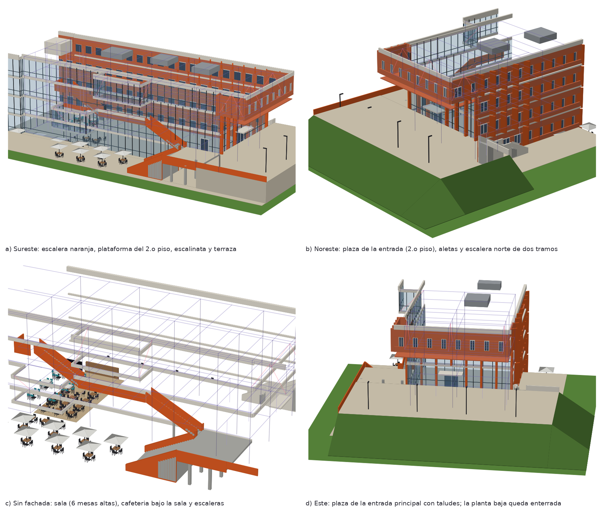

*Figura 13b. Vista previa de la capa de arquitectura generada desde los mismos datos que dibuja Unity (matplotlib, no es una captura de Unity), con la estructura en líneas moradas: a) sureste, b) noreste, c) sin fachada y d) este.*

El grupo compiló la capa en el Editor de Unity y la revisó con las tres capas activas (figura 13c). La estructura del modelo se ve en verde a través del vidrio.


*Figura 13c. Capturas del viewer en Unity, de arriba abajo:*
- *Fachada sur: escalera naranja hasta la plataforma del piso 2, escalinata y terraza de la cafetería.*
- *Extremo este: plaza de la entrada principal a la altura del piso 2.*
- *Fachada norte: escalera de dos tramos con descanso y terraza norte.*

**Estado de funciones.**

| Función | Estado | Dónde en Unity | ¿Requiere reanálisis? |
|---|---|---|---|
| Navegación | lista | arrastrar con el botón izquierdo o el derecho para orbitar, botón central o Shift para desplazar, rueda para el zoom | no |
| Selección | lista | clic sobre el elemento; el panel de propiedades responde las seis preguntas | no |
| Apoyos | lista | capa *Apoyos* (VISTA) y MODIFICAR → *Apoyo* | ver: no; cambiar: sí |
| Ejes | lista | capa *Ejes* (VISTA) y ejes locales en las propiedades | no |
| Cargas | lista | flechas de G, Q y sismo; CARGAS → *Carga móvil*, *Carga en elemento* y *Persona (SQ4)* | no (casos unitarios ya calculados) |
| Áreas tributarias | lista | VISTA (por piso) y MODIFICAR → *Área trib.* | ver: no; cambiar: sí |
| Deformada | lista | resultado *Deformada*, con animación desde la barra superior o RESULTADOS | no |
| Diagramas | lista | axial, corte y momento, con etiquetas y escala | no |
| Superposición | lista | RESULTADOS → *Superposición en vivo* (λG, λQ, λEX, λEY) | no |
| `P-M` y demanda-capacidad | lista | panel P-M al seleccionar una columna o un muro; panel de capacidad al seleccionar una viga; colores por utilización | no |
| Modificación del modelo | lista | MODIFICAR (sección, armadura, apoyo, área tributaria, quitar elemento) y ANÁLISIS (cargas, material f'c, rigidez, combinaciones) | sí |
| Arquitectura (solo visual) | lista | VISTA → *Arquitectura*: fachada, escaleras y entorno, mobiliario (figura 13c) | no (no cambia ningún valor) |

**¿Ayuda el viewer a contestar las seis preguntas?** Sí. Al seleccionar un elemento, el panel de propiedades se ordena según esas preguntas. Ejemplo con la columna E1_287, la más exigida:

| Pregunta | Cómo la contesta el viewer | Ejemplo E1_287 |
|---|---|---|
| ¿Dónde está? | tag, edificio, piso, nodos I y J y ejes locales; además, el elemento se resalta en 3D | edificio 1, primer piso, entre sus nodos I y J |
| ¿Cómo está apoyado? | restricciones de sus nudos y capa *Apoyos* | nudo inferior empotrado en la base |
| ¿Qué lo carga? | área y carga tributaria, flechas de carga en 3D y combinación activa | carga de los pisos superiores, G + Q + sismo |
| ¿Cómo se deforma? | desplazamientos de sus extremos, deriva del entrepiso en columnas y deformada animada | deriva bajo el límite de 0,002 |
| ¿Qué fuerzas tiene? | N, V y M en el punto tocado y en los extremos; diagramas de axial, corte y momento | P y M de la combinación activa |
| ¿Cuánta capacidad tiene? | sección, armadura, curva P-M con el punto de demanda y factor de uso; en vigas, M(x) y V(x) contra φMn y φVn | factor de uso 0,41: cumple |

## 14. Visualización de apoyos, cargas, ejes y diagramas

- **Apoyos:** un dado bajo cada uno de los 74 nodos empotrados, con su etiqueta.
- **Ejes:** los ejes de grilla de los planos (A' a J y 1 a 3), leídos de los DXF.
- **Diafragmas:** contorno de cada piso y edificio, centro de masa y nodo maestro. Al hacer clic en el nodo maestro se ven el peso del piso y las fuerzas sísmicas.
- **Cargas:** G y Q como cargas repartidas del caso activo, y EX y EY como flechas en los nodos maestros.
- **Áreas tributarias:** al seleccionar un elemento se ven su área y su carga tributaria.
- **Diagramas N, V y M:**
  - Usan una escala común a todo el modelo, así que el tamaño compara barras entre sí.
  - El momento se dibuja del lado traccionado.
  - El índigo lavanda indica M+, N de tracción y V+; el rosa coral indica M−, N de compresión y V−.
  - Al pasar el mouse se lee x y el valor. Con "Etiquetas" se ven los máximos y los valores en los extremos I y J.
  - Mientras hay un diagrama activo, el modelo se muestra en alambre.
- **Deformada:** es curva, porque usa los giros de OpenSees. Se colorea por |u|, de índigo (menor) a dorado (mayor), y se puede animar.

## 15. Modificación del modelo

Las modificaciones se hacen desde Unity, en el PC, porque necesitan Python y OpenSees. Todas dejan intactos los archivos del modelo.

Después de reanalizar, Unity carga el modelo nuevo y abre *Resultados del modelo recalculado*. Ese panel muestra:
- el factor de uso máximo de vigas y columnas, cuáles no cumplen y los desplazamientos máximos;
- botones para ver la deformada animada, los momentos y la utilización.

| Modificación | Dónde | ¿Reanálisis? |
|---|---|---|
| Intensidad de carga (q_G, Q, Q de cubierta, sismo) | ANÁLISIS | sí |
| Propiedad del material (f'c del hormigón: E = 4700√f'c y capacidad ACI) | ANÁLISIS → *Material* | sí |
| Rigidez (factores de inercia) y combinaciones | ANÁLISIS | sí |
| Sección (otra del modelo, más pequeña o más grande, b y h en pasos de 5 cm, uno o todos los de esa sección) | MODIFICAR → *Sección* | sí |
| Armadura | MODIFICAR → *Armadura* | sí (solo capacidad) |
| Apoyo (empotrado, articulado, deslizante o sin apoyo) | MODIFICAR → *Apoyo* | sí |
| Área tributaria de una viga (cambia su G y su Q) | MODIFICAR → *Área trib.* | sí |
| Activar o desactivar un elemento | MODIFICAR → *Quitar* | sí |
| Carga puntual o repartida en un elemento, sola o sumada a G, C1, C2 o C3 | CARGAS → *Carga en elemento* | no |
| Carga móvil y persona sobre la losa | CARGAS | no |
| Volver al modelo vigente (*Descartar* y *Restaurar valores del modelo cargado*) | ANÁLISIS | no |

Fuera de Unity, los mismos cambios se pueden reproducir:
- editando los archivos de `data/`;
- con `exportar_resultados_unity.py --mods <archivo> --fc <MPa>`, donde el archivo trae los cambios con las claves `sections`, `supports` y `tributarias`;
- con `modificar_modelo.py`.

## 16. AR

**Estado: la APK oficial FIX03 fue probada y aprobada por el grupo en un teléfono Android** (octubre de 2026, según el registro del grupo; esta integración no repitió esa prueba). Es la APK `APK/P1G8_Honors_H5_H2_H3_fix03.apk`, FIX03 original, versión 0.5.3, código 109, con package `cl.uandes.mcoc.p1g8.ar.honors`, y su SHA-256 es `c2bf7f5ca4b15699193b093526ab948cc2b8354e016b121f949cd68a5cad4d4c`. Incluye los Honors H2, H3 y H5. La figura 19 muestra el modo maqueta 1:100. Faltan las capturas de los modos 1:1 y sobre plano (Anexo B).

**APK candidata fusionada (no oficial).** Al integrar el proyecto Unity de la entrega con el de Honors se compiló una APK candidata (`P1G8_Honors_FUSION_fix03_candidata_v2.apk`, SHA-256 `710a7ad5f24c0ae48e0afd6c63876fcc6a6ee7416729b77e4fb96e3023303832`). Coincide con la oficial en package, versión, código, arquitectura (arm64-v8a), permisos y escena (`ARHonorsScene`), pero está firmada con otra clave de depuración, por lo que no se instala sobre la oficial sin desinstalarla, y contiene un archivo de datos más. **No es la APK oficial, no está en este repositorio y no se probó en un teléfono.**


*Figura 19. La app AR en el teléfono: el edificio en maqueta 1:100 anclado al marcador, con los botones Filtros, Estado, Honors H5 · comparar y Honors H2 · QA.*

La app AR es la escena `ARScene`, con AR Foundation 6.6.2 y ARCore. Detecta el marcador `Proyecto1/ar/marcador_E1_243_imprimir.pdf` como imagen de referencia de 20 cm.

**Preparación del marcador**

1. Imprimirlo al 100 % y comprobar que el cuadrado mida 20 cm.
2. Pegarlo en la cara +X de la columna E1_243 (eje F-3, sala del voladizo), con el centro a 1,20 m del piso.

**Modos de visualización**

- *1:1 COLUMNA:* el modelo a escala real, anclado a la columna.
- *MAQUETA 1:100:* el marcador sobre la mesa.
- *SOBRE PLANO:* las columnas deben caer sobre el dibujo, lo que sirve para comprobar el registro.

**Panel de resultados.** Muestra el caso o la combinación y el elemento seleccionado, con accesos directos a E1_243 y E1_72. Para el elemento se ven N, V, M, desplazamiento, P-M y área tributaria.

**Registro y detalles técnicos**

- El panel FASE 2 muestra el registro imagen-anchor (Δ, Δθ y ruido).
- El log se lee con `adb logcat`, buscando `[ARQA]`.
- En equipos Samsung el IMU se fuerza a 200 Hz (`ImuBooster.java`).
- La app usa OpenGL ES 3.

El marcador de esta versión dice "MCOC P1_G8" y mantiene el mismo patrón de fondo. Después de regenerarlo hay que correr *MCOC/AR/Actualizar marcador* antes de compilar el APK.

## 17. Sidequests implementados

**Sidequest carga móvil.** Hay dos formas de carga móvil.

| Punto | Carga móvil sobre vigas (CARGAS → *Carga móvil*) | Persona sobre la losa, SQ4 (CARGAS → *Persona (SQ4)*) |
|---|---|---|
| Regla física | P sobre un tramo de largo L a una distancia a: regla de la palanca hacia sus nudos (F_A = P·b/L, F_B = P·a/L). El tramo flecta como empotrado y la respuesta global sale de los casos unitarios de OpenSees. | Reparto en dos direcciones de Grashof, α = Ly⁴/(Lx⁴+Ly⁴), y regla de la palanca hacia los cuatro bordes del paño. |
| Panel | recorrido de vigas, P, posición y velocidad | piso, P, posición, botones y teclas W A S D |
| Reparto | F_A y F_B en el panel | carga que recibe cada viga, con su posición |
| Conservación de la carga | F_A + F_B = P y Σ Rz = P, con aviso OK | Σ cargas asignadas = P ✓ |
| Respuesta visual | la carga avanza sobre las vigas y se actualizan los diagramas y la deformada | la persona se mueve, se resaltan las vigas receptoras y se muestra su carga en 3D |

**Componentes del sistema:**

- **Carga móvil:** sobre un recorrido de vigas, con casos unitarios y fuerzas de empotramiento.
- **Carga en un elemento:** puntual o repartida, con 12 casos unitarios.
- **Quitar elementos:** con reanálisis y comparación de la deformada.
- **Armadura editable:** con recálculo de la capacidad, la curva P-M y el DCR.
- **Cambio de sección:** con reanálisis.
- **Superposición en vivo:** con deslizadores λ.
- **Colorear por utilización.**
- **Deformada curva y animada.**
- **Reanálisis desde Unity:** con validación de las entradas.
- **Excel de esfuerzos:** por elemento y combinación (`exportar_excel_esfuerzos.py`).
- **Capturas automáticas:** del viewer y de la demo (`-autoshot`, `-demo`).
- **Registro AR fase 2:** imagen-anchor.

**Agregados en esta versión:**

- **Paleta "Arrebol":** centralizada en `Paleta.cs`, en el viewer y en la app AR.
- **Pasto y cielo:** suelo de pasto con textura procedural y cielo con tinte lila.
- **Figuras reproducibles:** `figuras_informe.py`, para las figuras de este informe.
- **Armadura real:** diámetros mixtos en columnas, una curva P-M por sección de muro con sus barras de borde y `actualizar_armadura.py`, que recalcula la capacidad sin OpenSees.
- **Paneles movibles y redimensionables:** en el viewer, más un lanzador de Python que busca un intérprete con openseespy.
- **SQ4, persona sobre la losa:** una persona (carga puntual P) camina por un piso con W A S D o con botones.
  - *Panel:* identifica el paño de losa que pisa.
  - *Regla física:* reparte la carga en dos direcciones con Grashof, α = Ly⁴/(Lx⁴+Ly⁴), y la regla de la palanca hacia los cuatro bordes.
  - *Respuesta visual:* resalta las vigas receptoras y muestra en 3D la carga asignada a cada una.
  - *Conservación:* comprueba que la suma de lo asignado es P.
- **Capacidad de vigas:** al seleccionar una viga se dibujan M(x) y V(x) del caso activo contra φMn⁺, φMn⁻ y φVn, con CUMPLE o NO CUMPLE y el factor de uso.
- **Esfuerzos totales con la carga en elemento:** la carga puntual o repartida se ve sola o sumada a G, C1, C2 o C3, con sus flechas en 3D y los esfuerzos del elemento.
- **Resultados tras reanalizar:** después de quitar un elemento o de cambiar sección, armadura, apoyo, área o material, aparece un resumen de resultados.
- **Órbita libre:** sin botones de vista fija; la deformada se anima desde la barra superior.
- **Arquitectura solo visual:** fachadas, escalera naranja con su plataforma y la escalinata, plaza de la entrada en el piso 2, escalera norte de dos tramos, sala de Métodos Computacionales y cafetería bajo la sala, a partir de fotos del edificio. Es un archivo aparte, sin collider, que no cambia ningún valor.

## 18. QA y tests

**QA de resultados.** `qa_semana06.py` toma unos 10 s y deja la evidencia en `Proyecto1/resultados/qa_semana06.json`:

| Verificación | Resultado |
|---|---|
| Equilibrio G y Q | ΣRz = carga aplicada (error ≈ 0): OK |
| Corte basal EX y EY | ΣR = Σ fuerzas sísmicas: OK |
| NCh433, en los dos edificios | C dentro de [C_min, C_max], ΣF = Q0 y ΣA_k = 1: OK |
| Superposición C1 a C3 | error máximo ≈ 0: OK |
| Derivas NCh433 (5.9.2 y 5.9.3) | máximo en el centro de masa 0,00146 ≤ 0,002 y en cualquier punto 0,00202 ≤ centro de masa + 0,001: OK |
| Convergencia M-φ | 0,02 % entre 20 × 20 y 40 × 40 (< 1 %): OK |
| P-M de columnas (118) | C máximo 0,41 (E1_287, C2): OK |
| P-M de muros (91) | ningún muro con C > 1 (máximo 0,20, MURO-066): OK |
| IDs de Unity | 1 023 elementos, IDs y tags únicos, sin fuerzas faltantes: OK |

Esta tabla y `qa_semana06.json` se generaron con el modelo corregido (sección 8) usando la réplica de verificación de OpenSees (sección 20), no con OpenSees real, y el archivo no registra el motor. **Pendiente:** repetir `qa_semana06.py`, `sensibilidad_rigidez.py` y `exportar_excel_esfuerzos.py` con OpenSees real.

**Tests automáticos.** La suite `pytest` tiene 51 casos en 7 archivos:

| Archivo | Casos | Verifica |
|---|---|---|
| `test_modelo.py` | 10 | equilibrio por caso, corte basal igual a las fuerzas sísmicas, superposición lineal, unidades, ejes locales ortonormales, junta sin nodos compartidos y diafragmas por edificio |
| `test_cargas.py` | 6 | que el reparto tributario conserve el área de losa, Q por nivel, peso sísmico, C de la NCh433 calculado a mano, tabla de C_max y criterio de C fijo |
| `test_capacidad.py` | 8 | convergencia M-φ, puntos ACI de la P-M de columna, P-M frente a fibras, que la M-φ termine en el aplastamiento, flexión de viga a mano, notación de barras, diámetros mixtos (4φ28+16φ36) y P-M de muros con su armadura real |
| `test_unity_json.py` | 6 | integridad del JSON de Unity, capas de la demo, equilibrio del resumen, curvas de diseño, trazabilidad y coincidencia con OpenSees |
| `test_h4_reanalisis.py` | 13 | validación de entradas y que el reanálisis de Unity sea igual a la corrida directa, y los cambios de apoyo, área tributaria y material pedidos desde Unity |
| `test_h5_armadura.py` | 2 | que más armadura regenere la curva P-M, aumente la capacidad y baje el DCR |
| `test_arquitectura_visual.py` | 6 | que la arquitectura visual sea un archivo aparte válido y al día con el generador, que la sala tenga 6 mesas y la cafetería quede solo bajo la sala, los dos niveles del terreno con la escalera norte y la escalinata, que nada choque con la estructura y que generarla no cambie el modelo ni los resultados |

```bat
python -m pytest                  :: los 51 casos, unos 40 s
python -m pytest -m "not lento"   :: sin las corridas completas del exportador, unos 10 s
```

**Resultado tras integrar Honors (7 de octubre de 2026):** `py -3.12 -m pytest` → **51 passed** en 36,04 s, con Python 3.12.10, OpenSeesPy 3.8.0.0 y OpenSees real (sin `MCOC_REPLICA`), sobre el árbol fusionado y con los dos exportadores ya fusionados (ver más abajo). La corrida se hizo en una copia de la fusión fuera de OneDrive, de contenido idéntico al integrado aquí.

**Resultado de la corrida previa (antes de integrar Honors):** `py -3.12 -m pytest -ra` → **45 passed** en 47,08 s, con Python 3.12.10, OpenSeesPy 3.8.0.0 y OpenSees real (sin la variable `MCOC_REPLICA`), sobre el JSON regenerado con OpenSees real (commit `15ba09b`). Los paquetes instalados coinciden con `requirements.txt` y `pip check` no informa conflictos.

**Historial del único fallo.** Con el JSON anterior (generado con la réplica), `test_unity_igual_a_opensees_directo` fallaba: la diferencia en fuerzas de elementos superaba 10⁻⁶ kN (máximo 8,7 · 10⁻⁵ kN en `W_MURO-056`, combinación EY, error relativo 8 · 10⁻⁹). Dos corridas consecutivas con OpenSees real dieron resultados idénticos (OpenSees es determinista en esta máquina). Al regenerar el JSON con OpenSees real la prueba pasó, sin cambiar tolerancias ni código.

**Verificación de la integración con Honors (7 de octubre de 2026).** Se fusionaron en una copia de trabajo el proyecto Unity de la entrega y el proyecto Unity de Honors (APK FIX03), sin modificar ninguno de los dos. Las pruebas se corrieron en una copia de esa fusión (Unity 6000.6.0f1, Python 3.12.10, OpenSeesPy 3.8.0.0 real) cuyos `Assets`, `Packages`, exportadores y `freeze_originales.json` coinciden con los de este repositorio.

| Prueba | Resultado |
|---|---|
| pytest (Python/OpenSees real) | 51 passed |
| Unity EditMode | 64/64 aprobadas |
| Unity PlayMode | 23/23 aprobadas. `HonorsCapacityFlowTests.ScenarioFailureDiscardAndNativeRegeneration`, que antes fallaba porque faltaba `honors_comparar_armadura.py`, ahora pasa |
| Importación y compilación de Unity | 0 errores (los avisos son de APIs obsoletas) |
| Escenas en Play (modo batch) | `StructureViewerScene`, `ARHonorsScene`, `HonorsViewerScene` y `ARScene` cargan sin excepciones del proyecto. El viewer conserva la arquitectura visual, Persona SQ4, la capacidad de vigas y `DiagramController`; en `ARHonorsScene` están activos H5 y H2 y H3 queda apagado al abrir |

- *Exportadores fusionados.* `exportar_resultados_unity.py` conserva los apoyos, las áreas tributarias, f'c (`--fc`) y `--mods` de la entrega, e incorpora `export_contract` (validación del análisis, exigencia de OpenSees real y campos de Honors). `exportar_excel_esfuerzos.py` incorpora la versión ampliada del complemento sin perder ninguna función. Prueba puntual con salida temporal: sin cambios, el JSON regenerado coincide con el vigente (diferencia máxima 0,0 en 7 161 registros de fuerzas); con el apoyo del nodo 7 articulado, el área de E1_1 en 8,0 m² y f'c = 40 MPa los cambios quedan reflejados; el Excel se genera con 1 023 elementos y 91 muros. No se regeneró ningún resultado oficial.
- *JSON estructural.* El JSON de `Assets/Resources` es el del proyecto Honors (esquema `mcoc.ar/2.0`), necesario para el catálogo Honors; sus resultados son idénticos a los de la entrega. Las rutas absolutas de `catalog_manifest.json` se reemplazaron por rutas relativas sin tocar sus hashes (el catálogo solo verifica `catalogSHA256`).
- *Inicialización doble del viewer.* Quedó resuelta con la versión de Honors: `Start` solo crea la estructura en Play y en el Editor se carga de forma diferida. En el log aparece una sola línea "Estructura lista".
- *Viewer de Windows.* No fue regenerado después de incorporar el complemento de Honors. Se conserva el build anterior (`Builds/Windows/P1G8_Viewer.exe`, 125,8 MB, que no se versiona). Es válido porque `Packages` es idéntico y las únicas diferencias de `Assets` son archivos generados por pruebas o builds (una escena temporal de los tests de PlayMode y `XRGeneralSettingsPerBuildTarget.asset`). Tres intentos de recompilarlo se detuvieron sin terminar.
- *Evidencia histórica de Honors.* `entrega/honors` contiene ensayos, resultados y manifiestos de Honors. Se copió para trazabilidad: no se reejecutó y no se presenta como prueba nueva. En el repositorio solo se versionan `proteccion`, `H2`, `H5`, `H5_demostracion`, `QA`, `unity_H5` y los manifiestos y CSV de primer nivel; el resto (sesiones, ensayos, copias `baseline` y APK históricas) queda fuera de Git.
- *Sigue pendiente de prueba manual.* En el teléfono, con la APK fusionada o la oficial: anclaje, H2 (QA), H3 (diagramas My y Vz manuales) y H5 (comparación). En el Editor: panel H5 y reanálisis en `HonorsViewerScene`, y la interacción con las pestañas y la arquitectura visual del viewer de escritorio. QA, sensibilidad y Excel oficiales con OpenSees real (sección 18).

**Verificación de los cambios del grupo 8.**

- *Cambios visuales y de nombres:* no alteraron el cálculo. Los archivos de `data/` y el JSON de resultados quedaron idénticos byte a byte antes y después de esos cambios (antes de regenerar el JSON con OpenSees real, ver abajo), y en el Excel de esfuerzos las 65 268 celdas numéricas también.
- *Cambio de armadura:* modificó solo la capacidad. Fuerzas, desplazamientos y reacciones siguen idénticos. Con la armadura anterior, `actualizar_armadura.py` reproduce exactamente la capacidad del exportador en los 516 elementos.
- *4 apoyos sueltos:* se quitaron 4 apoyos que estaban en nodos sin ningún elemento (nodos 250 a 253). No tenían carga ni reacción, así que G, Q, EX y EY no cambian; solo bajan los registros de desplazamiento de 5 054 a 5 026.
- *Corrección de los muros:* antes de cambiar el modelo se comprobó que la réplica de verificación, con el exportador real del proyecto, reproduce la corrida de OpenSees. Las diferencias fueron de 10⁻¹⁰ m en desplazamientos y de 10⁻⁴ kN en fuerzas, con los mismos períodos y DCR. Después se cambiaron dos cosas: la inercia de los muros a 1,0 Ig y los muros a `ElasticTimoshenkoBeam`, con deformación por corte.
- *Elementos completos:* los 1 023 elementos son idénticos a los del modelo anterior a los cambios. Solo se quitaron 4 nodos con apoyo que no tenían ningún elemento.
- *Pruebas:* con la réplica de verificación pasaba toda la suite. Con OpenSees real pasaron los 45 casos que tenía la suite antes de agregar las 6 pruebas de la arquitectura visual, que no usan OpenSees. Se actualizó la prueba que simula los argumentos de Unity, que traía fijos los factores de rigidez antiguos.
- *JSON regenerado con OpenSees real:* `estructura_p1l4_unity.json` se volvió a generar con OpenSees 3.8.0.0 (commit `4b44709`, mismas entradas: los hash de modelo, parámetros, combinaciones y armaduras no cambian). Diferencias respecto de la versión con réplica: reacciones de G y Q del orden de 10⁻⁷ kN, cortes basales de EX y EY del orden de 10⁻⁵ kN, desplazamiento máximo del orden de 10⁻⁷ mm y fuerzas de elementos hasta 8,7 · 10⁻⁵ kN. El DCR es idéntico en los 516 elementos con capacidad; el DCR máximo (vigas 0,998 en E1_56, columnas 0,409 en E1_287), los conteos (718 nodos, 1 023 elementos, 91 muros) y las combinaciones no cambian. El JSON nuevo agrega `resumenAnalisis.fc_MPa = 35`.

## 19. Limitaciones

1. **Tipo de análisis.** Es estático y lineal elástico. El sismo es pseudoestático (NCh433): no hay análisis modal espectral, y las fuerzas se aplican en el centro de masa sin excentricidad accidental, así que la torsión accidental no está considerada.
2. **Idealización.** Los muros son columnas anchas con brazos rígidos, no elementos placa. Las losas no se modelan: solo reparten carga y forman el diafragma rígido. La rigidez fisurada usa factores constantes.
3. **Deriva.** La deriva máxima en el centro de masa es 0,00146, bajo el límite de 0,002 de la NCh433, y en cualquier punto es 0,00202; ambas las verifica el QA. Se midió en el nodo maestro de cada diafragma, que está cerca del centro de masa pero no exactamente en él.
4. **Armadura del documento.** El documento de armaduras del grupo no es un plano de enfierradura completo: no trae vigas, losas, fundaciones, confinamiento de muros, empalmes ni anclajes. Lo que faltaba se completó con supuestos, todos listados en `data/armaduras.json`:
   - estribos de columnas;
   - pórticos extremos en los ejes I' y A;
   - columna especial = E1_291;
   - barras de borde de los muros que no están en el documento y φ32 en los muros de 0,20 m;
   - separación de las filas de borde;
   - armadura de vigas.

   Hay tres puntos a revisar en el detalle:
   - φ40 no es un diámetro habitual de A630-420H en Chile (llega hasta φ36);
   - el confinamiento de los bordes de muro no está diseñado;
   - la columna fuerte–viga débil (ACI 18.7.3.2) no se verificó nudo por nudo.
5. **Capacidad de vigas.** La armadura de vigas es supuesta: la tipo de los planos, llevada a la cuantía mínima, y diseñada en las 25 vigas que no cumplían. Hay que contrastarla con la armadura real de los planos.
6. **Elementos metálicos.** Los pilares y arriostres tienen curva P-M, pero no entran en el conteo de DCR. El documento indica acero A240ES y tubos de 50 mm de espesor en vigas y diagonales. Los planos indican A36 y V.M. 300x300x5 (5 mm), y se mantuvieron los planos, porque 50 mm parece un error y cambiaría el análisis.
7. **Resumen tributario por piso.** El que muestra la pestaña VISTA (`tributaryList` del JSON) está desactualizado:
   - Suma 3 183 m², mientras que el análisis reparte 6 137 m² entre los elementos.
   - En CIELO_4 la carga y el área no son consistentes.
   - El análisis usa los valores de cada elemento, que son los que se muestran al seleccionarlo.
8. **Apoyos del edificio 1.** 12 de sus columnas están empotradas en z = 0, sobre el subterráneo. Es una condición de borde que conviene revisar.
9. **Planos DXF.** No están en el repositorio. `generar_ejes_grilla.py` los busca en `../Planos_1_dxf`.
10. **Reanálisis.** Solo funciona en un PC con Python y OpenSeesPy; en el teléfono el viewer es de solo lectura.
11. **AR.** Depende de que el marcador mida exactamente 20 cm, de la iluminación y de un teléfono compatible con ARCore.
12. **Cambios por probar en Unity.** La paleta, el pasto y el cielo ya se probaron en Unity. La validación de cargas negativas, la restauración de valores y los reanálisis de H4 y H5 se probaron a mano en el Editor (Unity 6000.6.0f1, consola sin errores). Los paneles movibles y el nuevo lanzador de Python no tienen una prueba manual registrada en este informe.
13. **Calibración con ETABS.** La rigidez de los muros (1,0 Ig con deformación por corte) se eligió comparando con el modelo ETABS de referencia. Los períodos quedan entre −8 % y +7 % y los cortes basales entre −7 % y +2 %. La sobrecarga del edificio 1 es 26 % mayor que en ETABS, por los supuestos de uso y de áreas (sección 8).
14. **Vigas largas del edificio 2.** En los ejes x = −33,98 y −41,48 m hay vigas de cerca de 16 m apoyadas en muros y vigas, sin columnas intermedias, como en los datos del plano 2024_22. Su flecha con G (unos 25 mm con 0,35 Ig) está bajo L/240, pero conviene confirmar en los planos que no hay columnas ahí.
15. **Columnas del voladizo.** Las columnas metálicas del voladizo sur del piso 2 trabajan como tirantes por el sentido del arriostre leído de la elevación 2017_67-802. En ETABS la C21 está comprimida, así que conviene confirmar en esa elevación hacia dónde baja el arriostre.
16. **Solver de verificación.** Si se activa la casilla en Unity y falta OpenSees, el recálculo usa `replica_opensees.py`, una réplica de las funciones de OpenSees que usa el proyecto. Reproduce las corridas reales (mismos desplazamientos, fuerzas y períodos), pero no es OpenSees: la corrida oficial de la entrega debe hacerse con OpenSees, y el JSON indica el motor usado.
17. **Interfaz.** Hasta la integración con Honors, el agente no había ejecutado Unity: sus cambios de C# se revisaban de forma estática y el grupo los compilaba y probaba en el Editor. En la integración sí se ejecutó Unity en modo batch (importación, tests EditMode y PlayMode y carga de las escenas; sección 18), pero eso no reemplaza la prueba manual de la interfaz. Para los cambios de H4 y H5 eso ya se hizo (punto 12), y la capa de arquitectura visual también se compiló y se vio en el Editor (figura 13c). Los demás cambios de la interfaz (sub-paneles, recorte, cámara, editor de secciones) siguen sin una prueba manual registrada aquí.
18. **Combinaciones C1 a C3.** Sus factores están pendientes de confirmar con el enunciado o el profesor (sección 7).
19. **QA, sensibilidad y Excel.** Se generaron con la réplica de verificación y están pendientes de repetirse con OpenSees real (sección 18).
20. **AR.** El grupo probó y aprobó la APK oficial FIX03 en el teléfono (sección 16); esa prueba no se repitió al integrar el proyecto, y la APK candidata fusionada no se probó en un teléfono. Faltan las capturas de los modos 1:1 y sobre plano.
21. **Inicialización doble del viewer.** Quedó resuelta al integrar Honors: `StructureViewer.Start` solo crea la estructura en Play y en el Editor la carga es diferida, y el log muestra una sola línea "Estructura lista" (sección 18).
22. **Capturas del viewer.** Faltan las capturas del Anexo B.
23. **Arquitectura aproximada.** La fachada, las escaleras, el terreno y el mobiliario se dibujaron a partir de fotos, no de planos de arquitectura, así que su ubicación es aproximada. Por ejemplo, la plaza de la entrada a la altura del piso 2, la plataforma y la escalinata del extremo este, y la cafetería en el rectángulo de la planta baja bajo la sala. Las medidas están al comienzo de `generar_arquitectura.py` para ajustarlas, y son solo visuales.

## 20. Uso de IA

Se usó **Claude** (Anthropic), un asistente conversacional con un entorno aislado para ejecutar código. En la primera etapa ese entorno no tenía OpenSees ni Unity, así que el agente no pudo correr el análisis completo ni compilar el proyecto. En las sesiones recientes (ver abajo) se trabajó en el PC del grupo, con Python 3.12.10 y OpenSeesPy 3.8.0.0, y el agente ejecutó el análisis y las pruebas. Unity sigue sin ejecutarlo el agente: el grupo compila y prueba el Editor y reporta el resultado.

**Tareas delegadas**

1. Organizar la carpeta del grupo 8: proyecto Unity, scripts, datos, pruebas e informe.
2. Definir la identidad del proyecto G8 en:
   - la carpeta del proyecto Unity (`edificio_G8`) y las rutas de scripts y tests;
   - los nombres e identificadores de las apps Android (`cl.uandes.mcoc.p1g8`);
   - los textos de la interfaz;
   - el marcador AR, regenerado con el texto P1_G8.
3. Cambiar la paleta visual del viewer y la app AR, centralizándola en `Paleta.cs`, y agregar el suelo de pasto procedural y el cielo.
4. Verificar que esos cambios no alteraran los resultados.
5. Escribir `figuras_informe.py` y redactar el borrador de este informe y del README.
6. Aplicar la armadura del documento del grupo a columnas y muros. Esto incluyó:
   - completar lo que faltaba con supuestos revisados con ACI 318-19;
   - extender `capacidad_ha.py` a diámetros mixtos y muros con barras de borde;
   - actualizar las secciones de fibras;
   - escribir `actualizar_armadura.py` y ajustar las pruebas.
7. Hacer movibles y redimensionables los paneles del viewer, quitar 4 apoyos sueltos y mejorar el diagnóstico cuando el Python que llama Unity no tiene openseespy.
8. Comparar el modelo con los resultados ETABS del profesor, revisar que no faltaran elementos y corregir lo necesario: muros con 1,0 Ig y deformación por corte. Para eso el agente escribió una réplica de verificación de la API de OpenSees (numpy/scipy), porque su entorno no tiene OpenSees.
9. Revisar la interfaz de Unity con los problemas reportados por el grupo y corregirla. Los cambios fueron:
   - *Arranque:* la interfaz nueva no se activaba en el equipo del grupo, así que se volvía a la antigua, sin el editor de secciones ni los paneles movibles. Ahora cada parte se construye por separado y registra su error.
   - *Superposiciones:* había paneles IMGUI encima de otros y el panel de quitar elemento aplastaba al editor de secciones. Se resolvieron con sub-paneles y recorte al área de la pestaña.
   - *Cámara:* la órbita dependía de los FPS y solo funcionaba con el botón derecho.
   - *Cambio de sección:* se agregaron los botones *Más pequeña* y *Más grande*, los pasos de ±5 cm y la opción de aplicar el cambio a toda la sección.
   - *Python:* se agregó un diagnóstico del Python que usa Unity y el instalador `instalar_dependencias.bat`.
   - *Solver de verificación:* es un respaldo opcional (`replica_opensees.py`) para recalcular sin OpenSees, marcado en la trazabilidad.
   - *Segunda revisión de la interfaz:* las capturas del grupo seguían mostrando la interfaz antigua, así que se hicieron cinco cambios:
     - un vigilante que agrega la interfaz nueva aunque la escena falle antes;
     - un respaldo para el tema de estilos;
     - un aviso en pantalla con el motivo de cualquier falla;
     - la hoja de estilos devuelta a su forma que funcionaba;
     - la interfaz antigua ordenada, con la barra de diagramas en filas automáticas y el título de superposición en su propia fila.
   - *Propiedades:* el panel quedó ordenado por las seis preguntas del curso, con desplazamientos y deriva.
   - *Pauta completa:* se agregaron los cambios de apoyo, área tributaria y material (f'c) desde Unity, que el exportador aplica en un reanálisis; la SQ4 de la persona sobre la losa; el panel de capacidad de vigas; la carga en elemento sumada a una combinación; el resumen tras reanalizar; la verificación de tres estados de superposición; y las tablas de estado y de reanálisis.
   - *Validación:* primero comprobó que la réplica, con el exportador real del proyecto, reproduce la corrida de OpenSees.
   - *Diagnóstico:* luego la usó para el análisis modal.
   - *Regeneración:* finalmente cambió la rigidez de los muros y volvió a generar resultados, QA, sensibilidad y Excel.
   - *Corrida oficial:* la réplica no forma parte del repositorio; la corrida oficial debe hacerse con OpenSees. El JSON principal ya se regeneró con OpenSees real; el QA, la sensibilidad y el Excel siguen pendientes.
10. Agregar al viewer la arquitectura **solo visual** pedida por el grupo, a partir de sus fotos: fachadas, escalera naranja, plaza de la entrada en el piso 2, escalinata, escalera norte de dos tramos, la sala de Métodos Computacionales (6 mesas altas con taburetes) y la cafetería bajo la sala.
    - *Generación:* el agente escribió `generar_arquitectura.py`, que produce la geometría desde las coordenadas del modelo y revisa que no choque con columnas, vigas ni muros.
    - *Dibujo:* `StructureViewer.Arquitectura.cs` dibuja esa geometría sin collider.
    - *Verificación:* se comprobó que el modelo, los datos y los resultados quedan idénticos (huellas SHA-256) y se agregaron 6 pruebas (`test_arquitectura_visual.py`).
11. Agregar al proyecto la APK de realidad aumentada que el grupo probó y aprobó (`APK/`), con su foto en el README y en la sección 16 (figura 19), y capturas del viewer en Unity al README y a la sección 13 (figura 13c). El agente solo copió la APK, sin modificarla, y comprobó que su huella SHA-256 coincide con la de su ficha.

**Sesiones recientes: verificación con OpenSees real y correcciones en Unity**

Descripción factual, en el PC del grupo, con Python 3.12.10 y OpenSeesPy 3.8.0.0:

1. Se creó un repositorio Git local como respaldo del estado inicial del repositorio (commit `a313e0b`). Se instalaron en Python 3.12 las dependencias de `requirements.txt` y se ejecutó la suite: las pruebas rápidas pasaron (40) y en la corrida completa falló una prueba (sección 18).
2. Se diagnosticó ese fallo: el JSON vigente se había generado con la réplica de verificación. Dos corridas con OpenSees real dieron resultados idénticos, así que se regeneró solo el JSON principal con OpenSees real (commit `15ba09b`) y los 45 casos pasaron sin cambiar tolerancias.
3. Con pruebas manuales del grupo en Unity, el agente corrigió tres problemas de la interfaz (commits `a31906c`, `4b44709`, `5b77560` y `2e5f6a0`): la excepción por JSON vacío o nulo al cargar el viewer, el rechazo de cargas negativas en el reanálisis y la restauración de los campos al descartar el escenario.
4. Se documentó la evidencia manual de H4 y H5 (capturas en `reports/img` y `reports/evidencia_H5.md`, commits `2e5f6a0` y `159269a`).
5. En esta etapa se actualizó este informe con esos resultados y con los pendientes.
6. Integración con Honors (7 de octubre de 2026): se fusionaron en una copia de trabajo el proyecto Unity de la entrega y el de Honors, se fusionaron por contenido los dos exportadores, se incorporó el complemento de Honors y se repitieron las pruebas: 51 de pytest, 64/64 de EditMode y 23/23 de PlayMode (sección 18). No se reconstruyó el viewer de Windows; se generó una APK candidata que no es la oficial y no se probó en un teléfono (sección 16).

**Errores detectados por el agente**

- La grilla de referencia del suelo del viewer se dibujaba en un plano vertical, porque `CreateGroundGrid` intercambiaba los ejes Y y Z. Se reemplazó por el plano de pasto.
- El resumen de áreas tributarias por piso de la pestaña VISTA no corresponde al reparto que usa el análisis (sección 19).
- `resultados/sensibilidad_rigidez.json` corresponde a una corrida anterior del modelo (sección 8).
- La documentación de Unity indicaba teclas y colores de diagramas que no coincidían con el código; la deformada es la tecla 4.
- Los `.bat` tenían saltos de línea Unix y se pasaron a CRLF, para evitar problemas de `cmd` con `goto`.
- La verificación P-M de muros del QA no pasaba con la malla φ12@200 escalada. Con la armadura de borde del documento ahora pasa.
- El documento llama "columna especial ID 70" a una columna, pero en este modelo el elemento 70 es una viga (E1_70). Se supuso la columna más exigida.
- Con los estribos del documento cada 100 mm (EDφ10a10) no se cumplía el confinamiento de ACI 18.7.5.4. La armadura tipo de V60/80 y V30/80 quedaba bajo la cuantía mínima. Dos φ40 por fila no caben en muros de 0,20 m. Los tres puntos se corrigieron.
- Había 4 apoyos en nodos sin ningún elemento (nodos 250 a 253), que se veían sueltos sobre el pasto. Se quitaron.
- El error "Falta instalar openseespy" al quitar un elemento venía del Python que llama Unity, que no tenía openseespy. Ahora Unity busca un Python que lo tenga y el mensaje indica qué Python usó y cómo instalarlo.
- Con los muros en 0,35 Ig, el edificio 2 tenía modos acoplados en diagonal y quedaba en C_min, con cortes 18 % y 34 % menores que ETABS. Se corrigió con la inercia bruta de los muros.
- Los muros sin deformación por corte dejaban el edificio 1 demasiado rígido en X: su período salía 23 % más corto que en ETABS. Se corrigió con `ElasticTimoshenkoBeam`.
- `StructureViewer.CreateStructure` trataba un `overrideJson` vacío como un override válido, lo que producía "JSON vacío" y luego un `NullReferenceException` en `UnityData.LoadData`. Se corrigió.
- Los campos q_G, Q y Q cubierta recortaban los valores negativos a 0 (`Mathf.Max`), así que Q = −100 no se rechazaba: se analizaba con Q = 0. Se corrigió y ahora se rechaza con un mensaje claro.
- *Descartar* y *Restaurar valores del modelo cargado* devolvían los resultados originales pero dejaban en los campos los valores del escenario (Q = 300, Q cubierta = 0). Se corrigió.
- `exportar_resultados_unity.py` sin `--out` también reescribe `data/semana3_resultados_unity.json` (un efecto lateral); para regenerar solo el JSON principal se usó `--out`.
- `StructureViewer` se inicializa dos veces (`OnEnable` y `Start`). No se ha modificado.
- Las vigas de unos 16 m del edificio 2 y la tracción en las columnas del voladizo se revisaron. Coinciden con los datos de los planos y con la lectura de la elevación 2017_67-802, así que no se cambiaron (sección 19).

**Verificaciones hechas por el agente**

- Corrió los 45 casos con OpenSees real (45 passed) y comparó el JSON anterior con el regenerado.
- Comparó byte a byte los datos y resultados antes y después de los cambios, e hizo la comparación registro por registro de fuerzas y desplazamientos (sección 18).
- Corrió las pruebas del JSON de Unity que no requieren OpenSees.
- Recalculó la curva M-φ con el integrador del proyecto.
- Comprobó que el cambio de armadura y la eliminación de los apoyos sueltos no alteran fuerzas ni reacciones, y que el script nuevo reproduce la capacidad del exportador.
- Revisó los cambios de C# de forma estática: que existan todas las referencias a `Paleta` y que llaves y paréntesis estén balanceados.
- Tras integrar Honors, repitió pytest con OpenSees real (51 passed) y ejecutó en Unity 6000.6.0f1 los tests EditMode (64/64) y PlayMode (23/23), además de cargar las cuatro escenas en modo Play (sección 18).
- Comprobó que la APK oficial FIX03 guardada en `APK/` tiene el SHA-256 indicado en la sección 16, y que los exportadores del repositorio son idénticos a los verificados en la fusión.

**Contribución real del agente**

Su aporte fue:

- la adaptación al grupo 8 (identidad, paleta, pasto, cielo y paneles movibles);
- la aplicación de la armadura del documento del grupo y los supuestos para completarla;
- la comparación con el modelo ETABS de referencia y la corrección de la rigidez de los muros;
- la verificación de que los resultados no cambiaron;
- el script de figuras;
- el borrador de la documentación.

Los datos técnicos de este informe se tomaron del código y de los archivos de resultados del repositorio, no de memoria.

**Otros usos de IA del grupo:** (completar).

## 21. Contribución individual

<!-- Cada integrante completa con lo que hizo y revisó en persona. El profesor puede pedir que se explique cualquiera de estos puntos. -->

### (Integrante 1: nombre)

- **Contribuciones:**
- **Módulo revisado:**
- **Error detectado:**
- **Concepto aprendido:**

### (Integrante 2: nombre)

- **Contribuciones:**
- **Módulo revisado:**
- **Error detectado:**
- **Concepto aprendido:**

### (Integrante 3: nombre)

- **Contribuciones:**
- **Módulo revisado:**
- **Error detectado:**
- **Concepto aprendido:**

## 22. Honors Track

Los objetivos Honors del Unity de escritorio están implementados y verificados:
- **H4:** reanálisis OpenSees en vivo.
- **H5:** cambio de refuerzo con regeneración de la interacción.

En la app del teléfono, la APK oficial FIX03 que el grupo probó y aprobó incluye H2 (QA) y H3 (diagramas My y Vz), además de H5 (sección 16). La ficha de esa APK no menciona H1. Tras la integración, H2, H3 y H5 siguen presentes en el proyecto Unity fusionado (H3 apagado al abrir), pero la APK candidata fusionada no se probó en un teléfono.

**Condición del núcleo.** Los puntos Honors solo se evalúan si el núcleo no tiene errores graves:

| Punto del núcleo | Evidencia |
|---|---|
| Equilibrio | QA: Σ reacciones = cargas aplicadas en G, Q, EX y EY, con diferencias menores que 10⁻⁵ kN |
| Unidades | kN, m y kN·m en todo el modelo, con conversión explícita de kg/m² y de las tablas de ETABS (N y N·mm) |
| Ejes | `test_modelo.py`: ejes locales ortonormales y orientación de vigas, columnas y muros |
| Cargas | QA y `test_cargas.py`: G y Q aplicadas = reacciones, y el reparto tributario conserva el área |
| Superposición | QA (C1 a C3) y verificación de tres estados (sección 7), con error de 10⁻⁸ o menos |
| Curvas P-M | `test_capacidad.py`: puntos ACI, comparación con fibras y muros con su armadura real |
| AR básica | APK probada y aprobada por el grupo en el teléfono (sección 16, figura 19) |

**H4: reanálisis OpenSees en vivo.**

| Requisito | Cómo se cumple | Evidencia |
|---|---|---|
| Unity envía cambios y recibe resultados | `PythonJob` corre `exportar_resultados_unity.py` en segundo plano con los parámetros y los cambios: combinaciones, secciones, armadura, apoyos, áreas tributarias y f'c. Al terminar, Unity carga el escenario y muestra el resumen de resultados | ANÁLISIS → *Reanalizar* y MODIFICAR → *Reanalizar ahora* |
| Motor | OpenSees real, con Python 3.12.10 y OpenSeesPy 3.8.0.0. Unity informa "Motor de cálculo: OpenSees, con py -3.12" | 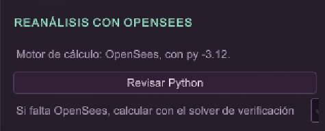 |
| Validación | en Unity (`ValidateInputs`, antes de lanzar Python) y en Python (`validacion_entradas.py` y el exportador): rangos de q, sismo, rigidez y f'c; combinaciones, secciones y armadura; nodos de apoyo y áreas | `test_validacion_rechaza` (7 casos) y `test_exportador_sale_con_codigo_2`; capturas del rechazo, abajo |
| Manejo de errores | Unity muestra el código de salida y la última línea del error, diagnostica el Python y OpenSees (*Revisar Python*) y avisa en pantalla si la interfaz falla. El solver de verificación es un respaldo opcional, marcado en la trazabilidad | `PythonJob.cs` y README §4.2 |
| Ejecución reproducible | cada corrida guarda en el JSON el comando, la fecha, las versiones de Python y OpenSees, el motor de cálculo y el SHA-256 de cada entrada. El mismo comando se puede repetir desde la consola | campo `corrida` del JSON |
| Comparación contra corrida directa | el escenario que pide Unity se compara con la corrida directa de OpenSees con los mismos parámetros | `test_unity_igual_a_opensees_directo` y `test_escenario_q300_vs_directo`, con diferencias de 10⁻⁹ m o menos en desplazamientos y de 10⁻⁶ kN o menos en fuerzas |

**Reanálisis con Q = 500 frente a Q = 300 kg/m².** Prueba manual en Unity. Valores leídos de las capturas. En el escenario Q = 300 solo cambió Q de piso: la carga de cubierta permaneció en 200 kg/m². Lo respalda la aritmética de las cifras: en una corrida con Q de piso igual a 0 y cubierta de 200 kg/m², la cubierta aporta unos 2 803 kN. Para Q = 300 la parte de piso es 16 653 − 2 803 ≈ 13 850 kN, que coincide con 0,6 × (25 886 − 2 803) ≈ 13 850 kN, o sea la parte de piso del caso base escalada por 300/500.

| Magnitud | Base, Q = 500 | Reanálisis, Q = 300 |
|---|---|---|
| Q aplicada / ΣRz | 25 886 / 25 886 kN | 16 653 / 16 653 kN |
| \|u\| máximo con Q | 10,64 mm | 6,41 mm |
| Corte basal EX / EY | 9 483 / 7 798 kN | 9 250 / 7 668 kN |
| Factor de uso máximo, vigas | 1,00 (E1_56) | 0,95 (B3085_V40/80a) |
| Factor de uso máximo, columnas | 0,41 (E1_287) | 0,40 (E1_287) |
| G aplicada / ΣRz | 75 701 / 75 701 kN | 75 701 / 75 701 kN |

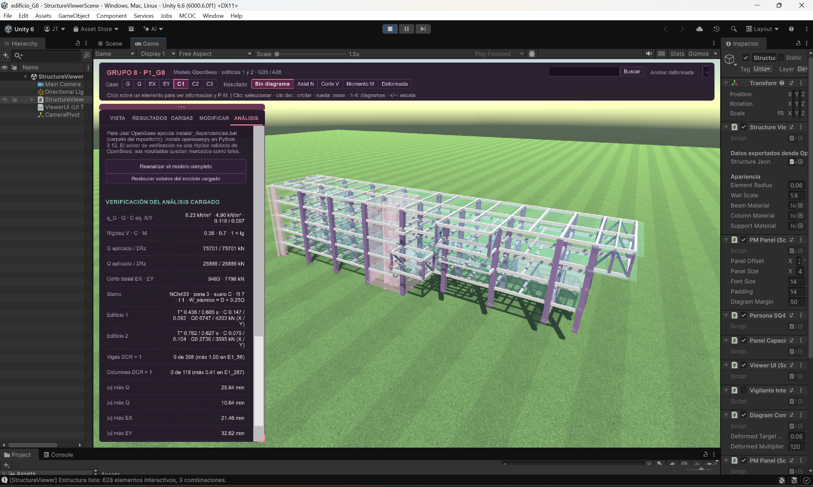

*Figura H4-1. Escenario base (Q = 500 kg/m²).*

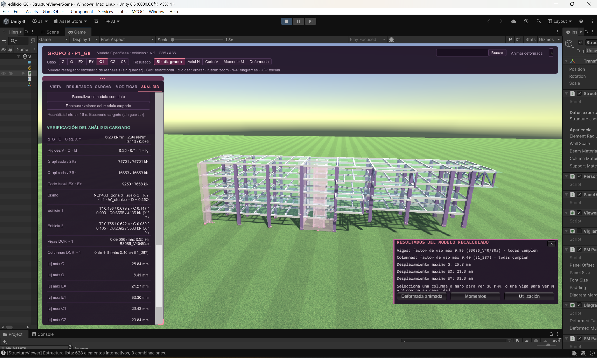

*Figura H4-2. Reanálisis válido con Q = 300 kg/m². Unity lo marca como "escenario cargado (sin guardar)".*

**Validación de entradas negativas.** Con Q = −100 kg/m² el reanálisis se rechaza antes de ejecutar OpenSees, con el mensaje "Q sobrecarga de uso = −100 kg/m²: debe ser mayor o igual a cero". Con Q de cubierta = −5 y q_G = −1 se rechazan los dos campos a la vez. En ambos casos no se carga ningún escenario y se conservan los últimos resultados válidos. Antes de esta corrección el campo recortaba el valor negativo a 0 y el reanálisis se ejecutaba con Q = 0 (sección 20).

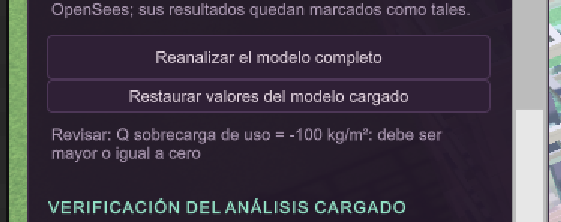

*Figura H4-3. Rechazo de Q = −100 kg/m².*

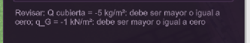

*Figura H4-4. Rechazo conjunto de Q cubierta = −5 kg/m² y q_G = −1 kN/m².*

**Restauración.** *Descartar* y *Restaurar valores del modelo cargado* vuelven al modelo vigente y actualizan de inmediato los campos visibles y la sesión interna a los valores del JSON (Q = 500, Q de cubierta = 200 y el resto de los parámetros). Un reanálisis posterior con los valores originales dio de nuevo Q aplicada ≈ 25 886 kN y desplazamiento máximo con Q de 10,64 mm. Antes de la corrección, los campos quedaban con los valores del escenario descartado.

Nivel propuesto: 4 (integrado, robusto y sobre el alcance base).

**H5: cambio de refuerzo con regeneración de la interacción.**

| Aspecto | Cómo se cumple | Evidencia |
|---|---|---|
| Cambio de refuerzo desde Unity | MODIFICAR → *Armadura*, con la notación 16φ28, 4φ28+16φ36 o EDφ10a6, para un elemento o toda su sección | `AnalysisSession` envía `--armaduras` |
| Regeneración de la interacción | se recalculan la curva P-M de cada columna (con diámetros mixtos) y de cada muro (con sus barras de borde reales), φMn y φVn de las vigas, y el DCR | `capacidad_ha.py` y `actualizar_armadura.py`; pruebas `test_curva_regenerada`, `test_mas_armadura_mas_capacidad_menor_dcr`, `test_columna_diametros_mixtos` y `test_pm_muros_con_armadura_real` |
| Visualización | panel P-M con el punto de demanda y la combinación activa; panel de capacidad de vigas (M y V contra φMn y φVn); colores por utilización; resumen tras reanalizar | Unity |
| Material | f'c editable: cambia la rigidez y regenera la capacidad | ANÁLISIS → *Material* |

**Prueba manual con la columna E1_287 (COL70/70).** Se cambió la armadura de 16φ28 a 20φ28 y se reanalizó con OpenSees:

| Estado | Ast | DCR C1 | DCR crítico |
|---|---|---|---|
| Original, 16φ28 | 9 852 mm² | 0,392 | 0,392 (C1) |
| Modificado, 20φ28 | 12 315 mm² | 0,329 | 0,343 (C2) |

Unity regeneró la curva P-M después del reanálisis (el diagrama pasó de `COL70/70_16f28` a `COL70/70_20f28`). El escenario se descartó y no se guardó: el modelo oficial sigue con 16φ28. Las capturas y el detalle están en [`evidencia_H5.md`](evidencia_H5.md).

Nivel propuesto: 3 a 4.

**Pendientes.**
- *Honors de la app:* H1 (Cardboard VR), H2 (AR avanzada) y H3 (AR estructural avanzada) no se han trabajado.
- *Extensiones opcionales de H5:* no están implementadas la interacción biaxial P-Mx-My, la capacidad del miembro frente a la de la sección (esbeltez) ni el análisis de segundo orden (P-Δ).

---

## Anexo A. Guion de la demostración (laboratorio, semana 7)

| # | Ítem de la demo base | Cómo mostrarlo en el viewer |
|---|---|---|
| 1 | Geometría | VISTA con todas las capas; cámaras ISO, TOP, FRONT y RIGHT |
| 2 | Apoyos y restricciones | capa Apoyos, vista FRONT; seleccionar un apoyo |
| 3 | Ejes | capa Ejes, vista TOP (A' a J, 1 a 3) |
| 4 | Diafragmas | capa Diafragmas; clic en un nodo maestro para ver W y F |
| 5 | Áreas tributarias | seleccionar una viga: área y carga tributaria |
| 6 | Cargas G, Q, EX y EY | capa Cargas y selector de caso en la barra superior |
| 7 | Deformada | RESULTADOS → Deformada (tecla 4), con escala y animación |
| 8 | Diagramas | Axial, Corte y Momento (teclas 1 a 3), con etiquetas; buscar E1_72 |
| 9 | Superposición con sliders | RESULTADOS → superposición en vivo (λG, λQ, λEX, λEY) |
| 10 | P-M de columna | buscar E1_287 (la más exigida) o E1_260 |
| 11 | P-M de muro | buscar W_MURO-013 |
| 12 | Punto de demanda | en los paneles P-M, los puntos de C1 a C3 |
| 13 | Modificación de dos parámetros | ANÁLISIS: por ejemplo Q de 500 a 300 kg/m² y suelo de C a D, luego *Reanalizar*. Con suelo D, C crece (S = 1,20 y T' = 0,85 s) y sube el corte basal. Terminar con *Descartar* |
| 14 | AR básica | app P1G8_AR con el marcador impreso: modos 1:1, maqueta y sobre plano |

**Flujo completo para la defensa** (`planos → datos → OpenSees → resultados → Unity → AR`):

1. **Planos.** Los DXF 2017_67 y 2024_22 definen la grilla, las secciones y los niveles.
2. **Datos.** `estructura_completo_unity.json`, ajustado a los planos por `ajustar_modelo_planos.py`, junto con los parámetros, las combinaciones y las armaduras de `data/`.
3. **OpenSees.** `carga_viva_sismo.py` arma el modelo, calcula G, Q, EX y EY y los resuelve.
4. **Resultados.** `exportar_resultados_unity.py` agrega las combinaciones y la capacidad ACI, y escribe `estructura_p1l4_unity.json`.
5. **Unity.** El viewer lo dibuja y, en el PC, reanaliza llamando a Python.
6. **AR.** La misma información, anclada al marcador de la columna E1_243.

## Anexo B. Capturas pendientes

Las figuras siguientes se retiraron del cuerpo del informe porque los archivos no existen todavía. Hay que generarlas desde el Editor de Unity (escena `Assets/Scenes/StructureViewerScene`, en Play y con la vista Game), guardarlas en `reports/img/demo/` con el nombre indicado y volver a insertarlas en la sección y con la leyenda indicadas. No se necesita un ejecutable.

| Figura | Archivo | Qué debe mostrar | Sección |
|---|---|---|---|
| 1 | `demo01_geometria.png` | geometría del modelo, vista ISO | 3 |
| 2 | `vista_tributarias.png` | pestaña VISTA con las áreas tributarias | 4 |
| 4 | `demo08_superposicion.png` | superposición en vivo con λG = 1, λQ = 0,5, λEX = 1 y λEY = 0,3 | 7 |
| 5 | `demo06_deformada.png` | deformada de C1 coloreada por \|u\| | 8 |
| 9 | `demo09_PM_columna.png` | panel P-M de una columna con su punto de demanda | 11 |
| 10 | `demo10_PM_muro.png` | panel P-M del muro W_MURO-013 | 11 |
| 12 | `demo12_utilizacion.png` | elementos coloreados por utilización | 12 |
| 13 | `demo11_parametros.png` | pestaña ANÁLISIS con los parámetros editables | 13 |
| 14 | `demo02_apoyos.png` | apoyos empotrados, vista FRONT | 14 |
| 15 | `demo03_ejes.png` | ejes de grilla, vista TOP | 14 |
| 16 | `demo04_diafragmas.png` | diafragmas rígidos por piso y edificio | 14 |
| 17 | `demo05_cargas_G.png`, `demo05_cargas_Q.png`, `demo05_cargas_EX.png`, `demo05_cargas_EY.png` | cargas G, Q, EX y EY | 14 |
| 18 | `demo07_diagrama_momento.png` | diagrama de momento con la viga E1_72 seleccionada | 14 |

**Capturas de la app AR.** Se toman con el teléfono y se guardan en `reports/img/ar/`. La app ya está probada (sección 16) y la captura de maqueta 1:100 ya está en el informe. Faltan las otras dos:

| Figura | Archivo | Qué debe mostrar | Estado |
|---|---|---|---|
| 19 | `ar_1a1_columna.jpg` | modo 1:1 anclado a la columna E1_243 | pendiente |
| 19 | `ar_maqueta_1a100.jpg` | modo maqueta 1:100 | lista |
| 19 | `ar_sobre_plano.jpg` | modo sobre plano | pendiente |
